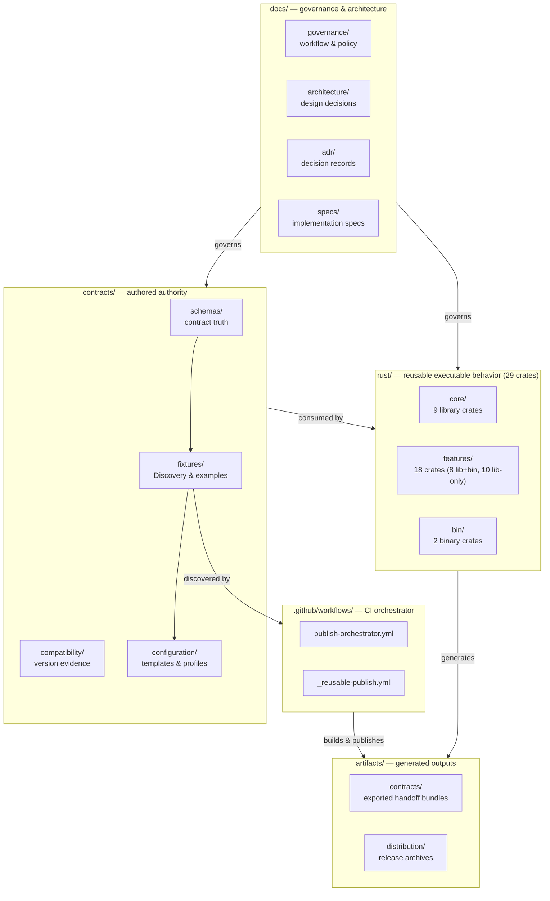
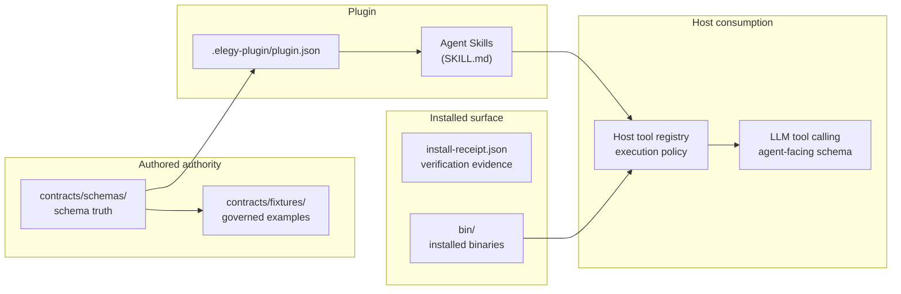
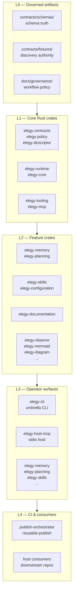

# Elegy Ecosystem Topology

## Purpose

This document defines the current high-level organization of the Elegy ecosystem so docs, exports, and implementation ownership stay aligned with the repo that actually exists.

The main goal is to keep Elegy reusable across Holon and non-Holon projects while staying:

- contract-first
- provider-agnostic
- framework-agnostic where possible
- honest about the currently shipped executable surfaces

## Top-level decision

`Elegy` is now a contracts-and-tooling monorepo.

Its active design centers are:

- governed schemas, fixtures, manifests, and policy rooted under `contracts/`
- the first-party Rust workspace under `rust/`, which owns the reusable executable and operator-facing surfaces

Legacy `src/`, `tests/`, solution files, and `.NET` package-family narratives are not active repo centers and should not be described as such in current docs.

Historical `Elegy-Skills`, `Elegy-CLI`, and related sibling repos should be treated as archival or transition references rather than the current implementation home.

### Repo layout

## Repo centers

### Governed artifact roots

The durable authority in this repo is language-agnostic and lives in authored assets such as:

- schemas and fixtures under `contracts/`
- version and release policy under `contracts/schemas/`
- operational policy (workflow, environment, branch enforcement modes) under `docs/governance/`
- exported downstream handoff bundles under `artifacts/contracts`

These assets are the source of truth for downstream consumers. They should be preferred over reviving a removed source-package tree.

### Rust executable family

The first-party executable and runtime layer lives under `rust/`.

The key current crates are:

- `elegy-contracts` for governed-contract consumption in Rust
- `elegy-policy` for bounded policy enforcement
- `elegy-mcp` for MCP analysis and related runtime behavior over governed descriptors
- `elegy-tooling` for descriptor authoring, analysis, and skill generation
- `elegy-core` and `elegy-runtime` for reusable composition surfaces
- `elegy-host-mcp` for the thin stdio host
- `elegy-cli` for the human-facing operator surface

### Current shipped operator slice

The current shipped operator path is intentionally narrow.

The current shipped operator surfaces are `elegy`, `elegy-memory`, `elegy-mcp`, `elegy-planning`, `elegy-skills`, `elegy-configuration`, and `elegy-documentation`.

What the repo proves today:

- the Rust `elegy` CLI exposes `author mcp`, `analyze mcp`, umbrella `skills ...`, and lower-level `generate skills` / `plugin export codex`
- the in-repo `elegy-memory` surface is shipped as a bounded local operator surface
- the in-repo `elegy-mcp` surface is shipped as a thin dedicated wrapper over descriptor authoring and descriptor analysis
- the in-repo `elegy-planning` surface is shipped as a dedicated wrapper over durable planning authority
- the in-repo `elegy-skills` surface is shipped as a thin dedicated wrapper over governed skill-registry access and validation
- the in-repo `elegy-configuration` surface is shipped as a dedicated wrapper over governed template/profile flows
- the in-repo `elegy-documentation` surface is shipped as a dedicated wrapper over documentation inspection, mapping, and non-authoritative export
- those commands are backed by shared Rust crates led by `rust/features/elegy-mcp`, `rust/features/elegy-skills`, `rust/features/elegy-planning`, and `rust/core/elegy-tooling`
- the CLI also carries validation, inspection, and stdio-host startup entrypoints
- contract bundles can be exported and consumed independently of the Rust workspace

What the repo does **not** yet prove as a completed product surface:

- built-in MCP-native self-authoring loops
- skill-driven autonomous authoring built into the runtime as a finished user surface
- broad claims that REST/OpenAPI ingestion, operation-catalog projection, or hosted MCP execution are implemented just because descriptor analysis and generation exist

Those remain targets until the repo has a documented, validated, contributor-facing implementation for them.

## Burden-of-proof rule

Capability existence is not the same thing as long-term repo-center status.

Under the current architecture reset, a shared Elegy surface should survive only if it proves one of two things:

1. it is governed authority that downstream consumers must consume consistently
2. it is a reusable Rust executable capability that multiple consumers should use without product-specific assumptions

If a capability can be represented as schemas, fixtures, manifests, compatibility metadata, policy files, or docs, prefer those artifacts over shared code.

If a capability depends on host-specific auth, persistence, UI, HTTP endpoints, DI composition, tenant policy, or app orchestration, it belongs in the consuming repo rather than in Elegy.

### Contract authority chain

How governed artifacts flow from authored truth to host consumption:

## Dependency shape across the repo

The dependency direction should remain one-way:

1. governed artifacts and operational policy at the bottom
2. Rust contract consumers and policy crates above those authored assets
3. runtime-composition and adapter crates above the contract and policy layer
4. operator surfaces such as `elegy-cli` and `elegy-host-mcp` on top
5. downstream apps consuming exported bundles, explicit Rust crates, or CLI outputs

That means:
- contracts and operational policy define the durable boundary
- Rust crates consume governed artifacts rather than redefining them
- operator shells remain thin over explicit runtime and tooling crates
- docs must not imply a removed source-package center just because downstream consumers may still be `.NET`

### Authority hierarchy

The five-layer dependency stack, bottom-up:

## Consumer guidance

For near-term integration and migration work, prefer the smallest real Elegy surface that carries the responsibility:

- use `contracts/` and exported bundles for stable schema, fixture, and compatibility handoff
- use Rust crates under `rust/` only for proven reusable executable behavior
- keep host-specific endpoints, orchestration, and prompt assembly in the consuming repo
- do not assume sibling checkout layouts, solution-level builds, or removed package-family roots

## Split policy for future repos

If a surface later proves it needs its own release cadence, contributor base, or implementation language, it can split into a dedicated repo.

That split should happen only after:

- the boundary is already stable
- at least two real consumers exist
- the split improves ownership more than it increases coordination cost

## Current practical stance

For now, the most coherent working model is:

- `Elegy` is the single active repo
- governed authority lives in root artifact and policy directories, not in a removed `.NET` source tree
- `rust/` is the first-party home for reusable executable surfaces, especially CLI, MCP analysis, descriptor tooling, policy-bounded runtime composition, and host layers
- the current contributor-facing self-authoring story is the Rust CLI author/analyze/generate path over governed descriptors, exposed through both the umbrella `elegy` surface and the dedicated `elegy-mcp` / `elegy-skills` binaries
- built-in MCP or skill-driven self-authoring remains a target and should not be documented as a completed surface until the repo proves it end to end
