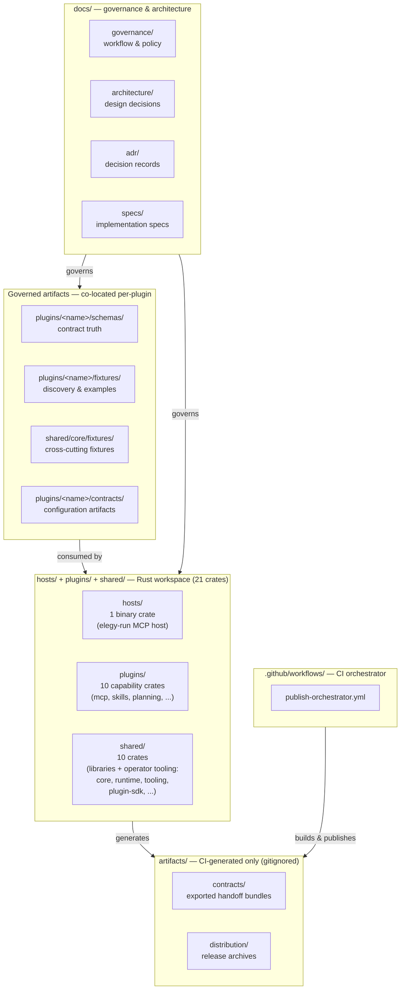
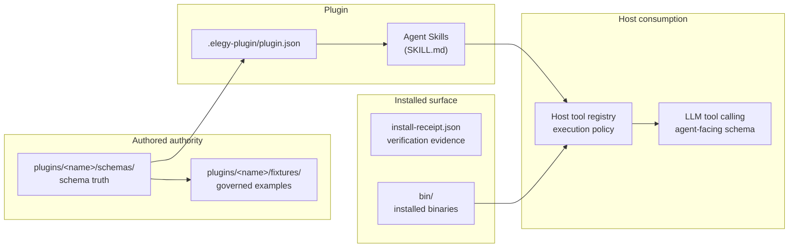
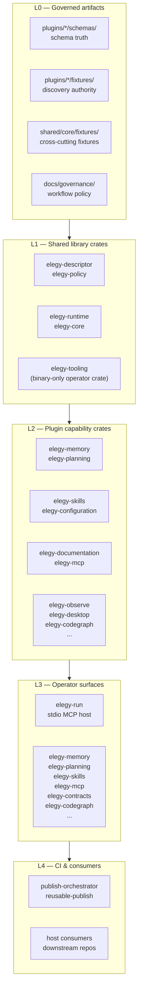

# Elegy Ecosystem Topology

## Purpose

This document defines the current high-level organization of the Elegy ecosystem so docs, exports, and implementation ownership stay aligned with the repo that actually exists.

The main goal is to keep Elegy reusable across Holon and non-Holon projects while staying:

- contract-first
- provider-agnostic
- framework-agnostic where possible
- honest about the currently shipped executable surfaces

## Top-level decision

`Elegy` is now a capabilities-and-tooling monorepo.

Its active design centers are:

- governed schemas, fixtures, manifests, and policy co-located with their owning plugins under `plugins/<name>/schemas/`, `plugins/<name>/fixtures/`, and `plugins/<name>/contracts/`; cross-cutting fixtures live in `shared/core/fixtures/`
- the first-party Rust workspace at the repo root, organized into `hosts/`, `plugins/`, and `shared/`

Legacy `src/`, `tests/`, solution files, and `.NET` package-family narratives are not active repo centers and should not be described as such in current docs.

Historical `Elegy-Skills`, `Elegy-CLI`, and related sibling repos should be treated as archival or transition references rather than the current implementation home.

### Repo layout

## Repo centers

### Governed artifact roots

The durable authority in this repo is language-agnostic and lives in authored assets such as:

- per-plugin schemas under `plugins/<name>/schemas/`
- per-plugin fixtures under `plugins/<name>/fixtures/`
- cross-cutting fixtures under `shared/core/fixtures/`
- configuration artifacts under `plugins/<name>/contracts/`
- version and release policy defined in schemas
- operational policy (workflow, environment, branch enforcement modes) under `docs/governance/`
- exported downstream handoff bundles under `artifacts/contracts` (CI-generated only; `artifacts/` is gitignored)

These assets are the source of truth for downstream consumers. They should be preferred over reviving a removed source-package tree.

### Rust executable family

The first-party executable and runtime layer is organized as a Cargo workspace at the repo root with three top-level subtrees:

- **`hosts/`** — thin binary entrypoints (elegy-run MCP host)
- **`plugins/`** — capability crates, each owning its schemas, fixtures, and tests
- **`shared/`** — library crates reused across hosts and plugins

The key current crates are:

- `elegy-core` (`shared/core`) for reusable core primitives and cross-cutting fixtures
- `elegy-runtime` (`shared/runtime`) for runtime composition
- `elegy-descriptor` (`shared/descriptor`) for governed-descriptor types
- `elegy-policy` (`shared/policy`) for bounded policy enforcement
- `elegy-tooling` (`shared/tooling`) as the binary-only home of `elegy-plugin-packaging` for plugin verify/pack/export/install
- `elegy-plugin-sdk` (`shared/plugin-sdk`) for the publishable external plugin SDK
- `elegy-mcp` (`plugins/mcp`) for MCP analysis and related runtime behavior over governed descriptors
- `elegy-skills` (`plugins/skills`) for governed skill-registry access and validation
- `elegy-planning` (`plugins/planning`) for durable planning authority
- `elegy-memory` (`plugins/memory`) for bounded local memory surfaces
- `elegy-documentation` (`plugins/documentation`) for documentation inspection, mapping, and export
- `elegy-configuration` (`plugins/configuration`) for governed template and profile flows
- `elegy-run` (`hosts/host-mcp`) for the thin stdio MCP host

### Current shipped operator slice

The current shipped operator path is intentionally narrow.

The current shipped operator surfaces are each shipped as dedicated binaries: `elegy-planning`, `elegy-skills`, `elegy-memory`, `elegy-mcp`, `elegy-documentation`, `elegy-configuration`, `elegy-observe`, `elegy-desktop`, `elegy-contracts`, `elegy-codegraph`, and `elegy-run`.

Seven surfaces (`elegy-planning`, `elegy-skills`, `elegy-memory`, `elegy-mcp`,
`elegy-documentation`, `elegy-observe`, `elegy-desktop`) are packaged as
`elegy-plugin/v1` plugin archives. The portable plugin archive (`.plugin.zip`)
is the primary release contract; per-host Codex exports are derived host projections.
The remaining surfaces ship as standalone CLI binaries.

What the repo proves today:

- `elegy-mcp` provides MCP descriptor authoring and analysis
- `elegy-skills` provides governed skill-registry access and validation
- `elegy-planning` provides durable planning authority
- `elegy-memory` provides a bounded local operator surface
- `elegy-configuration` provides governed template and profile flows
- `elegy-documentation` provides documentation inspection, mapping, and export
- `elegy-observe` provides system observation
- `elegy-desktop` provides desktop automation
- `elegy-contracts` provides contract export, validation, and project inspection
- `elegy-codegraph` provides code graph analysis
- `elegy-run` provides the stdio MCP host
- those commands are backed by shared Rust crates led by `shared/core`, the `elegy-plugin-packaging` operator package under `shared/tooling`, and the `plugins/` tree
- contract exports can be produced and consumed independently of the Rust workspace via `elegy-contracts`

What the repo does **not** yet prove as a completed product surface:

- built-in MCP-native self-authoring loops
- skill-driven autonomous authoring built into the runtime as a finished user surface
- broad claims that REST/OpenAPI ingestion, operation-catalog projection, or hosted MCP execution are implemented just because descriptor analysis and generation exist

Those remain targets until the repo has a documented, validated, contributor-facing implementation for them.

## Burden-of-proof rule

Capability existence is not the same thing as long-term repo-center status.

Under the current architecture reset, a shared Elegy surface should survive only if it proves one of two things:

1. it is governed authority that downstream consumers must consume consistently
2. it is a reusable Rust executable capability that multiple consumers should use without product-specific assumptions

If a capability can be represented as schemas, fixtures, manifests, compatibility metadata, policy files, or docs, prefer those artifacts over shared code.

If a capability depends on host-specific auth, persistence, UI, HTTP endpoints, DI composition, tenant policy, or app orchestration, it belongs in the consuming repo rather than in Elegy.

### Contract authority chain

How governed artifacts flow from authored truth to host consumption:

## Dependency shape across the repo

The dependency direction should remain one-way:

1. governed artifacts and operational policy at the bottom
2. shared Rust contract consumers and policy crates above those authored assets
3. plugin capability crates above the shared layer
4. operator surfaces such as `hosts/host-mcp` (`elegy-run`) on top
5. downstream apps consuming exported bundles, explicit Rust crates, or CLI outputs

That means:
- per-plugin schemas, fixtures, and operational policy define the durable boundary
- Rust crates consume governed artifacts rather than redefining them
- operator shells remain thin over explicit runtime and tooling crates
- docs must not imply a removed source-package center just because downstream consumers may still be `.NET`

### Authority hierarchy

The five-layer dependency stack, bottom-up:

Plugin-surfaced binaries in L3 are discovered through their
`.elegy-plugin/plugin.json` manifests rather than listed as flat binaries.
`elegy-run`, `elegy-contracts`, and `elegy-codegraph` remain standalone
CLI surfaces without a plugin wrapper.

## Consumer guidance

For near-term integration and migration work, prefer the smallest real Elegy surface that carries the responsibility:

- use per-plugin schemas and fixtures, shared cross-cutting fixtures, and exported bundles for stable schema, fixture, and compatibility handoff
- use Rust crates under `hosts/`, `plugins/`, and `shared/` only for proven reusable executable behavior
- keep host-specific endpoints, orchestration, and prompt assembly in the consuming repo
- do not assume sibling checkout layouts, solution-level builds, or removed package-family roots

## Split policy for future repos

If a surface later proves it needs its own release cadence, contributor base, or implementation language, it can split into a dedicated repo.

That split should happen only after:

- the boundary is already stable
- at least two real consumers exist
- the split improves ownership more than it increases coordination cost

## Current practical stance

For now, the most coherent working model is:

- `Elegy` is the single active repo
- governed authority lives in co-located plugin artifacts (`plugins/<name>/schemas/`, `plugins/<name>/fixtures/`, `plugins/<name>/contracts/`) and cross-cutting `shared/core/fixtures/`, not in a removed `.NET` source tree or a centralized `contracts/` directory
- `hosts/`, `plugins/`, and `shared/` form the first-party home for reusable executable surfaces — MCP analysis, descriptor tooling, policy-bounded runtime composition, and the `elegy-run` MCP host
- the current contributor-facing self-authoring story is the Rust CLI author/analyze/generate path over governed descriptors, exposed through the dedicated `elegy-mcp` / `elegy-skills` binaries
- built-in MCP or skill-driven self-authoring remains a target and should not be documented as a completed surface until the repo proves it end to end
