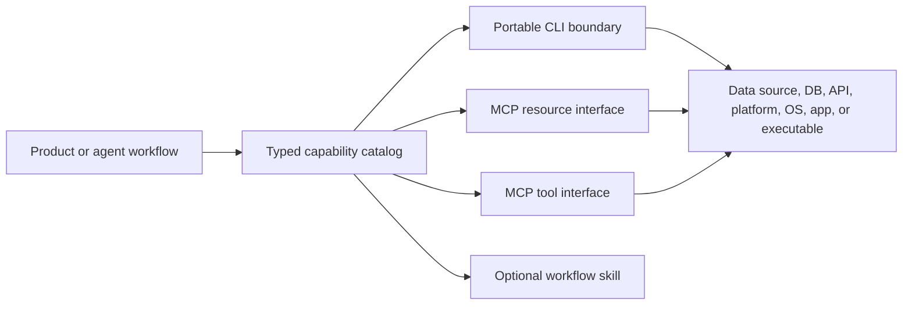

# Elegy ecosystem topology

Elegy is a Rust toolkit and evidence-gated distribution layer for reusable
agent-to-system adapters. It also contains standalone tools, skills, and host
adapters. Those neighboring surfaces are not plugins merely because they share
the repository or historical `plugins/` path.

The current machine-readable inventory is
[`distribution/surfaces.json`](../../distribution/surfaces.json); the generated
[readiness matrix](../readiness.md) is the human inventory.


```mermaid
flowchart LR
    product["Product or agent workflow"] --> catalog["Typed capability catalog"]
    catalog --> cli["Portable CLI boundary"]
    catalog --> resource["MCP resource interface"]
    catalog --> tool["MCP tool interface"]
    catalog --> skill["Optional workflow skill"]
    cli --> boundary["Data source, DB, API, platform, OS, app, or executable"]
    resource --> boundary
    tool --> boundary
```

Each catalog entry names exactly one concrete interface: `cli`,
`mcp-resource`, or `mcp-tool`. Skills and host layouts are guidance or
projections; they do not add a second kind. The v1 `app-binding` value is
legacy metadata and is usable only with a native Codex app connection binding.

## Surface classes

| Class | Owns | Does not imply |
|---|---|---|
| `adapter-plugin` | A reusable external-system boundary, typed operations, connection posture, and portable invocation | Usability without clean-install and real-task evidence |
| `tool` | Product, domain, analysis, validation, or development behavior | Connector eligibility |
| `skill` | Instructions and supporting resources | Runtime behavior or a typed capability |
| `host-adapter` | An optional protocol or host projection such as MCP | A new product or independent plugin |
| `host-extension` | Behavior coupled to one agent host | Cross-harness portability |

`kind` in the surface catalog controls build/release mechanics and is separate
from `surfaceClass`. Historical directory names are not classification.

## Active adapter distribution

An Elegy marketplace plugin must:

1. have `surfaceClass: adapter-plugin`;
2. have `lifecycle: active`;
3. set `packaging: plugin`;
4. declare a typed `capabilityCatalog`;
5. reference canonical readiness evidence.

The `elegy-package/v1` manifest and its declared `elegy-capability-catalog/v2`
operations are portable authority. Codex metadata, OpenCode/Claude layouts,
Holon registrations, and bundled skills are derived or optional host surfaces.
Credentials and deployment state stay with the connection provider or
operating host. The v1 `fallback` field has no active runtime consumer and
cannot change routing.

Accounts is the only active packaged adapter in the initial cleanup. Desktop
and Observe remain valuable adapter candidates in `rework`; their former
skill-only manifests were removed because those files did not prove an
executable, portable adapter package.

## Non-plugin behavior

- Planning, Memory, Documentation, MCP descriptor tooling, Checks,
  Configuration, Contracts, and Codegraph are tools.
- Documentation practices, Obsidian, plugin authoring, and skill authoring are
  skills.
- `elegy-run` and the Memory MCP transports are host adapters.
- OpenCode Workers and Codex Go Agents are blocked host extensions.
- Client Radar, AI Radar, and Question Studio remain with their product
  repositories as business libraries/tools.

The detailed migration record is
[`docs/deprecations.md`](../deprecations.md).

## Reuse boundary

Do not add a generalized adapter family, schema version, or host projection
because it might support future consumers. Expansion requires two independent
working consumers that demonstrate the same boundary, duplicated behavior, and
the smallest stable common contract. Product-local behavior remains local.

## Authority and validation

- Architecture decisions: `docs/adr/`
- Behavioral specifications: `docs/specs/`
- Surface class, lifecycle, and disposition: `distribution/surfaces.json`
- Readiness proof: each surface's `elegy-readiness/v1` artifact
- Adapter identity and executable discovery: `elegy-package.json` plus its
  capability catalog; active `.elegy-plugin/plugin.json` remains a migration
  compatibility surface
- Host projections: derived outputs, never primary authority

Run:

```powershell
./scripts/check-repo-shape.ps1 -FailOnIssues
cargo run -p elegy-documentation -- check --project .
cargo run -p elegy-tooling --bin elegy-plugin-packaging -- marketplace generate --project . --check
```
