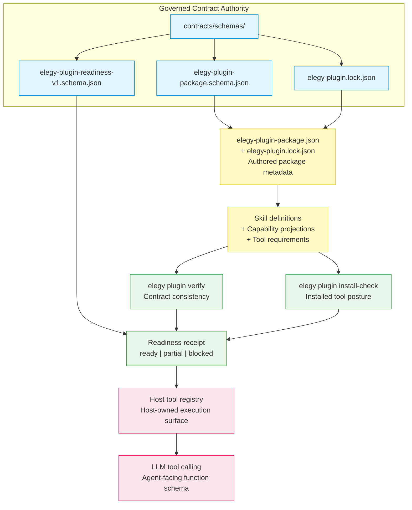

# Elegy Plugin Package Model

## Purpose

This document defines the Elegy plugin package model — the portable contract
bundle that lets hosts expose governed capabilities to LLM agents through skills,
capability projections, tool requirements, readiness receipts, and host-owned
execution policy.

Plugin packages are the primary setup path for bringing governed capabilities to
LLM hosts. Codex, OpenCode, and Holon are consumers of these packages, not
authorities over their shape or behavior.

## Package Shape

An Elegy plugin package is a JSON document governed by
`contracts/schemas/elegy-plugin-package.schema.json` at
`elegy-plugin-package/v1`. A companion lock file
(`elegy-plugin.lock.json`, governed by
`contracts/schemas/elegy-plugin.lock.json`) pins the exact contract bundle
version used to build the package.

### Core sections

| Section | Purpose | Schema field |
|---|---|---|
| **Identity** | Unique package identifier, name, version, and display name. | `identity: { packageId, name, version, displayName? }` |
| **Metadata** | Description, tags, license, homepage, documentation URI. | `metadata: { description?, tags?, license?, homepage?, documentationUri? }` |
| **Components** | The package payload: skill definitions, instruction skills, capability projections, MCP projections, configuration templates/profiles, docs, assets, tool requirements, and host compatibility hints. | `components: { skillDefinitions[], instructionSkills[], capabilityProjections[], mcpProjections[], configurationTemplates[], configurationProfiles[], docs[], assets[], toolRequirements[], hostCompatibility[] }` |
| **Tool Requirements** | Declared runtime tools the host must satisfy before capabilities are useful. | `components.toolRequirements[]: { toolName, cliBinary, minVersion?, probeCommand?, description? }` |
| **Elegy Compatibility** | Contract bundle version pin and schema line. | `elegyCompatibility: { contractBundleVersion, schemaLine, minimumElegyToolingVersion?, contractsSource? }` |
| **Publishing / Provenance** | Source repository, ref, commit, changelog, and signature references for publishable packages. | `publishing: { sourceRepository, sourceRef, sourceCommit, changelogRef?, provenanceRef?, signatureRefs[] }` |
| **Lock file** | Companion artifact generated by `elegy plugin new`; must be version-controlled alongside the package. | `elegy-plugin.lock.json` (separate file) |

### Skill definitions

`components.skillDefinitions[]` carries governed `skill`
definitions, either inline or by reference through `definitionRef`. Each skill
is the contract authority for its capabilities, host projection metadata,
side-effect classes, and output contracts.

### Capability projections

`components.capabilityProjections[]` re-states skill capabilities in
host-projection terms: lane (`subprocess`, `cli`, `mcp`, `rust`, `api`,
`plugin`), function name, MCP tool name, side-effect class, and dry-run support.
These projections are the bridge between governed skill capabilities and the host
tool registry.

A package MAY project fewer capabilities than its referenced skill defines.
When it does, it declares the deliberate subset through `metadata.subsetOf`
— currently a flat array in v1, planned as a structured object
(`{ skill, version, omitted[], reason }`) in v2.

### Tool requirements

`components.toolRequirements[]` declares which CLI tools the host must have
installed for the package's capabilities to function. Each entry names a stable
tool (`toolName`), the CLI binary to resolve (`cliBinary`), and optional minimum
version, probe command, and description fields.

### Readiness receipt

`elegy plugin verify` produces a readiness receipt
(`elegy-plugin-readiness/v1`, governed by
`contracts/schemas/elegy-plugin-readiness-v1.schema.json`) for package
consistency: referenced skill definitions, capability projections, side-effect
classes, subset declarations, projected tools, and findings.

`elegy plugin install-check` uses the same readiness receipt family for installed
tool posture. It validates `components.toolRequirements[]` against an install
receipt, optional `--bin-dir`, and optional binary probes.

## Authority Chain



Authority flows in one direction: from governed contracts outward to host
projections. Host-generated files, runtime sessions, approvals, and policy
decisions never flow back into the package or contract authority.

## Setup Flow

The canonical plugin package setup flow:

1. **Create** a new plugin package scaffold:

   ```bash
   elegy plugin new --template cli-tool --output ./my-plugin
   ```

   This generates `elegy-plugin-package.json`, `elegy-plugin.lock.json`, and
   supporting templates in the target directory.

2. **Edit** `elegy-plugin-package.json` to declare package identity, metadata,
   components, capability projections, tool requirements, and publishing details.

3. **Keep** `elegy-plugin.lock.json` under version control. It pins the exact
   contract bundle version the package was built against.

4. **Verify** the package is contract-consistent:

   ```bash
   elegy plugin verify --package ./my-plugin/elegy-plugin-package.json --json
   ```

   This checks skill definition references, capability projections, side-effect
   class declarations, and subset posture.

5. **Check** installed tools against the package's declared tool requirements:

   ```bash
   elegy plugin install-check --package ./my-plugin/elegy-plugin-package.json --install-receipt ./tools/elegy/install-receipt.json --json
   ```

   Use `--bin-dir <path>` when a binary exists outside the receipt, and
   `--skip-probe` when the host wants shape-only installed-tool validation.

6. **Optional: project to host.** For hosts that consume Codex plugin
   projections, run:

   ```bash
   elegy generate codex-plugin --package <path> --output-dir <dir> --force
   ```

   This generates `.codex-plugin/plugin.json` and `skills/<id>/SKILL.md`
   as derived adapter surfaces. The generated files are never authority roots.

## Boundaries

The plugin package is a portable contract bundle. It is explicitly NOT:

- A runtime or execution engine
- A marketplace or discovery registry
- An authentication or authorization store
- An approval record or trust decision surface
- A secrets, lease-state, or session container
- A host policy engine

Hosts own install, auth, approvals, runtime sessions, sandboxing, and execution
policy. The package carries metadata, references, and projections; the host
decides whether and how to accept, trust, install, approve, and execute.

## Codex Projection

Codex plugin projection (`elegy generate codex-plugin`) is one optional
derived projection target, not the main plugin setup path. It generates
`.codex-plugin/plugin.json` and `skills/<id>/SKILL.md` from the package,
but the generated files remain non-authoritative adapter surfaces.

See [Codex Plugin Projection](codex-plugin-projection.md) for the full
projection rules.

## Related Documents

- [Plugin Tool Availability](../specs/plugin-tool-availability.md) — the durable
  contract for tool availability, verify-only flow, and readiness receipts.
- [Elegy Plugin Readiness](elegy-plugin-readiness.md) — publishing metadata and
  validation posture for host consumption.
- [Codex Plugin Projection](codex-plugin-projection.md) — conservative Codex
  projection slice and its boundaries.
- [Agent Integration](../agent-integration.md) — host onboarding and discovery.
