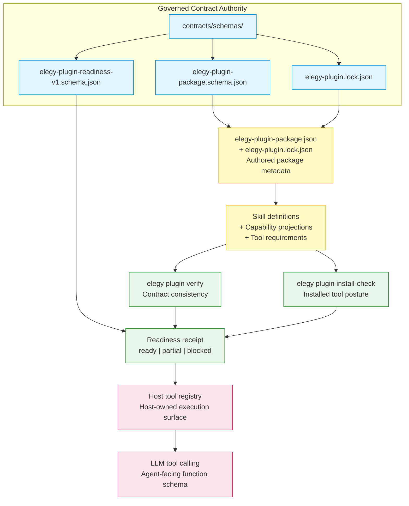

# Elegy Plugin Package Model

## Purpose

This document defines the Elegy plugin package model — the portable contract
bundle that lets hosts expose governed capabilities to LLM agents through skills,
capability projections, tool requirements, readiness receipts, and host-owned
execution policy.

Plugin packages are the primary setup path for bringing governed capabilities to
LLM hosts. Codex, OpenCode, and Holon are consumers of these packages, not
authorities over their shape or behavior.

## Package Shape

An Elegy plugin package is a JSON document governed by
`contracts/schemas/elegy-plugin-package.schema.json` at
`elegy-plugin-package/v1`. A companion lock file
(`elegy-plugin.lock.json`, governed by
`contracts/schemas/elegy-plugin.lock.json`) pins the exact contract bundle
version used to build the package.

### Core sections

| Section | Purpose | Schema field |
|---|---|---|
| **Identity** | Unique package identifier, name, version, and display name. | `identity: { packageId, name, version, displayName? }` |
| **Metadata** | Description, tags, license, homepage, documentation URI. | `metadata: { description?, tags?, license?, homepage?, documentationUri? }` |
| **Components** | The package payload: skill definitions, instruction skills, capability projections, configuration templates/profiles, docs, and tool requirements. | `components: { skillDefinitions[], instructionSkills[], capabilityProjections[], configurationTemplates[], configurationProfiles[], docs[], toolRequirements[] }` |
| **Tool Requirements** | Declared runtime tools the host must satisfy before capabilities are useful. | `components.toolRequirements[]: { toolName, cliBinary, minVersion?, probeCommand?, description? }` |
| **Elegy Compatibility** | Contract bundle version pin and schema line. | `elegyCompatibility: { contractBundleVersion, schemaLine, minimumElegyToolingVersion?, contractsSource? }` |
| **Extensions** | Free-form extension surface for host-specific or experimental metadata. Preserved on round-trip; not semantically validated by the contract. | `extensions: { ... }` (optional object, any JSON value allowed) |
| **Publishing / Provenance** | Source repository, ref, commit, changelog, and signature references for publishable packages. | `publishing: { sourceRepository, sourceRef, sourceCommit, changelogRef?, provenanceRef?, signatureRefs[] }` |
| **Lock file** | Companion artifact generated by `elegy plugin new`; must be version-controlled alongside the package. | `elegy-plugin.lock.json` (separate file) |

### Skill definitions

`components.skillDefinitions[]` carries governed `skill`
definitions, either inline or by reference through `definitionRef`. Each skill
is the contract authority for its capabilities, host projection metadata,
side-effect classes, and output contracts.

Component paths such as `definitionRef`, `instructionSkills[].path`, docs,
templates, and profiles are package-local paths. Resolve them relative
to the package JSON file unless a component explicitly defines a different
resolution rule. Maintained fixture packages under `contracts/fixtures/` follow
the same rule.

### Capability projections

`components.capabilityProjections[]` re-states skill capabilities in
host-projection terms: lane (`subprocess`, `cli`, `mcp`, `rust`, `api`,
`plugin`), function name, MCP tool name, side-effect class, and dry-run support.
These projections are the bridge between governed skill capabilities and the host
tool registry.

A package MAY project fewer capabilities than its referenced skill defines.
When it does, it declares the deliberate subset through `metadata.subsetOf`.
The marker is at package level, not per-entry, so reviewers see the whole
omission set in one place.

### Tool requirements

`components.toolRequirements[]` declares which CLI tools the host must have
installed for the package's capabilities to function. Each entry names a stable
tool (`toolName`), the CLI binary to resolve (`cliBinary`), and optional minimum
version, probe command, and description fields.

### Readiness receipt

`elegy plugin verify` produces a readiness receipt
(`elegy-plugin-readiness/v1`, governed by
`contracts/schemas/elegy-plugin-readiness-v1.schema.json`) for package
consistency: referenced skill definitions, capability projections, side-effect
classes, subset declarations, projected tools, and findings.

`elegy plugin install-check` uses the same readiness receipt family for installed
tool posture. It validates `components.toolRequirements[]` against an install
receipt, optional `--bin-dir`, and optional binary probes.

## Authority Chain



Authority flows in one direction: from governed contracts outward to host
projections. Host-generated files, runtime sessions, approvals, and policy
decisions never flow back into the package or contract authority.

## Setup Flow

The canonical plugin package setup flow is a hand-edited, dev-driven loop. The
schema and CLI are settled; the polished host-driven authoring lane (where a
harness such as Holon creates a new package programmatically) is tracked as a
deferred goal. See
[GOAL-20260616-01](../issues/unresolved-goals.md#goal-20260616-01).

For the **current** dev flow:

1. **Scaffold** a starter package (optional, hands-on starting point):

   ```bash
   elegy plugin new --template cli-tool --output ./my-plugin
   ```

   This generates a starter `plugin.json`, `elegy-plugin.lock.json`, a stub
    skill definition, and a `plugin-ci.yml` workflow. The scaffold is a
    starting point only — it is **not** a verified package, and running
    `elegy plugin verify` on a fresh scaffold will report contract issues
    (empty capabilities, missing hostProjection) that the next steps fix.

2. **Author the skill v2** under `contracts/fixtures/skill.<name>.json` (or
   inline `definition` for small fixtures). The skill must declare
   `capabilities[]` and `hostProjection` with `cliName`, `outputContractId`,
   `defaultSideEffectClass`, and one `capabilityProjections[]` entry per
   callable capability.

3. **Edit `plugin.json`** to declare package identity, metadata, components,
    capability projections, tool requirements, and (if the package will be
    published) publishing details. The schema and the `elegy-plugin-package-model`
    component table above are the two things to keep in mind.

4. **Keep `elegy-plugin.lock.json` under version control.** It pins the exact
    contract bundle version the package was built against.

5. **Verify** the package is contract-consistent:

    ```bash
    elegy plugin verify --package ./my-plugin/elegy-plugin-package.json --json
    ```

    This checks schema shape, skill definition references, capability
    projection consistency (R2.1, R2.2, R2.3, R2.5), side-effect class
    declarations, and subset posture. Inline-definition packages get full
    R2.x coverage; `definitionRef`-based packages get shape and lane checks
    but the validator does not yet resolve the external skill file to apply
    R2.3 and R2.5 (this is part of the deferred authoring lane).

6. **Iterate.** Edit the package or the skill to address any
    issues the verifier surfaces. There is no in-CLI `doctor` or
    `elegy plugin author` lane yet (deferred).

7. **Check installed tools** against the package's declared tool requirements:

   ```bash
   elegy plugin install-check --package ./my-plugin/elegy-plugin-package.json --install-receipt ./tools/elegy/install-receipt.json --json
   ```

   Use `--bin-dir <path>` when a binary exists outside the receipt, and
   `--skip-probe` when the host wants shape-only installed-tool validation.

8. **Optional: project to host.** For hosts that consume Codex plugin
    projections, run:

    ```bash
    elegy plugin export codex --package <path> --output-dir <dir> --force
    ```

    This generates `.codex-plugin/plugin.json` and `skills/<id>/SKILL.md`
    as derived adapter surfaces. The generated files are never authority roots.
    The legacy alias `elegy generate codex-plugin` remains available.

### What `elegy plugin new` is and is not

- It is a one-shot scaffolder for a starter directory.
- It is **not** an authoring tool, a host-callable capability, or a substitute
  for the schema and validator.
- The `elegy plugin new` command does not conflict with the future
  `elegy plugin author` or `elegy plugin doctor` lane. They serve different
  purposes: `plugin new` writes a starter file set; `plugin author` would
  walk the user (or a harness) through the full authoring decisions and
  drive the verify loop. The scaffolder remains useful as the lowest-friction
  starting point even after the authoring lane lands.

## Boundaries

The plugin package is a portable contract bundle. It is explicitly NOT:

- A runtime or execution engine
- A marketplace or discovery registry
- An authentication or authorization store
- An approval record or trust decision surface
- A secrets, lease-state, or session container
- A host policy engine

Hosts own install, auth, approvals, runtime sessions, sandboxing, and execution
policy. The package carries metadata, references, and projections; the host
decides whether and how to accept, trust, install, approve, and execute.

## Codex Projection

Codex plugin export (`elegy plugin export codex`) is one optional
derived projection target, not the main plugin setup path. It generates
`.codex-plugin/plugin.json` and `skills/<id>/SKILL.md` from the package,
but the generated files remain non-authoritative adapter surfaces.
The legacy alias is `elegy generate codex-plugin`.

See [Codex Plugin Projection](codex-plugin-projection.md) for the full
projection rules.

## Related Documents

- [Plugin Tool Availability](../specs/plugin-tool-availability.md) — the durable
  contract for tool availability, verify-only flow, and readiness receipts.
- [Elegy Plugin Readiness](elegy-plugin-readiness.md) — publishing metadata and
  validation posture for host consumption.
- [Codex Plugin Projection](codex-plugin-projection.md) — conservative Codex
  projection slice and its boundaries.
- [Agent Integration](../agent-integration.md) — host onboarding and discovery.
