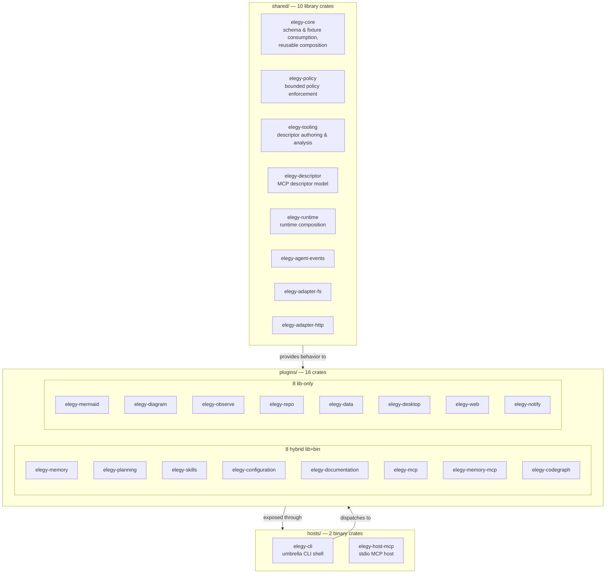
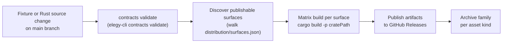

# Rust Consolidation

## Purpose

This document records the current consolidation decision after the legacy source and test tree was removed from the repo.

The main Elegy repo is now the intended long-term home for both:

- the governed artifact roots that define contracts, compatibility, and policy
- the first-party Rust workspace that carries the executable, runtime, and operator-facing surfaces

## Current consolidated shape

The repository now converges on this shape:

- `shared/` holds library/core crates for reusable executable behavior
- `plugins/` holds feature crates with plugin-owned artifacts co-located in each plugin's directory
- `hosts/` holds thin binary crates (CLI and MCP host)
- root docs and root scripts define the contributor and validation path

This is no longer a story about keeping a removed legacy package tree authoritative. The current question is simpler: which responsibilities belong in governed artifacts, which belong in Rust executable crates, and which should stay consumer-local.

### Workspace layout



## What stays authoritative now

The following remain canonical in the repo today:

- governed schemas and fixtures co-located in each plugin's directory
- version and release policy under plugin-owned `schemas/` directories
- operational policy under `docs/governance/`
- export and validation scripts at the repo root

These are the durable coordination surfaces that downstream consumers should rely on.

## What Rust owns now

The Rust workspace is the first-party home for:

- governed-contract consumption in executable form
- MCP descriptor authoring, analysis, and skill generation tooling
- the dedicated `elegy-memory`, `elegy-mcp`, `elegy-planning`, `elegy-skills`, and `elegy-configuration` binaries
- runtime composition and bounded adapter behavior
- the thin stdio MCP host
- the human-facing `elegy` CLI

The currently shipped self-authoring surface is the Rust CLI path for:

- `author mcp`
- `analyze mcp`
- `generate skills`
- `generate codex-plugin`

Those commands are backed by shared Rust crates led by `plugins/mcp` and `shared/tooling`, exposed through both the umbrella `elegy` CLI and the dedicated `elegy-mcp` / `elegy-skills` binaries, and exercised by CLI and tooling tests in the workspace.

### Crate dependency graph

```mermaid
flowchart TB
    subgraph leaves["Leaf crates (no intra-workspace deps)"]
        contracts["elegy-contracts"]
        descriptor["elegy-descriptor"]
        policy["elegy-policy"]
        planning["elegy-planning"]
        codegraph["elegy-codegraph"]
        diagram["elegy-diagram"]
        mermaid["elegy-mermaid"]
        repo["elegy-repo"]
        web["elegy-web"]
        data["elegy-data"]
        notify["elegy-notify"]
    end

    subgraph midlow["Middle-low crates"]
        mcp["elegy-mcp\n→ contracts"]
        agent_ev["elegy-agent-events\n→ contracts"]
        adapter_fs["elegy-adapter-fs\n→ descriptor, policy"]
        adapter_http["elegy-adapter-http\n→ descriptor, policy"]
        runtime["elegy-runtime\n→ contracts, mcp, adapters, descriptor, policy"]
    end

    subgraph mid["Core crates"]
        core["elegy-core\n→ agent-events, contracts,\ndescriptor, policy, runtime"]
        tooling["elegy-tooling\n→ contracts, mcp"]
    end

    subgraph features["Feature crates"]
        memory["elegy-memory\n→ contracts"]
        skills["elegy-skills\n→ contracts"]
        cfg["elegy-configuration\n→ contracts"]
        docs["elegy-documentation\n→ contracts, tooling"]
        mem_mcp["elegy-memory-mcp\n→ memory"]
        observe["elegy-observe\n→ contracts"]
    end

    subgraph top["Binary crates"]
        host["elegy-host-mcp\n→ contracts, core, skills"]
        cli["elegy-cli\n→ 16 workspace deps"]
    end

    leaves --> midlow
    midlow --> mid
    mid --> features
    features --> top
```



## What is still a target

The repo should not currently claim more than it proves.

These remain forward-looking targets rather than completed surfaces:

- built-in MCP-native self-authoring as a settled product surface
- skill-driven self-authoring loops presented as already integrated operator behavior
- broad autonomous agent workflows layered directly into the runtime by default
- claims that REST/OpenAPI ingestion, hosted MCP runtime execution, or autonomous registration are already shipped because the thin dedicated CLIs now exist

`elegy-host-mcp` exists, and the CLI includes runtime validation, inspection, and run entrypoints, but those facts do not by themselves justify a claim that the broader self-authoring experience is already delivered.

## Replacement rule

Prefer governed artifacts when the responsibility is:

- schema authority
- fixture and compatibility evidence
- policy and version governance
- machine-readable handoff for downstream consumers

Prefer Rust when the responsibility is:

- reusable executable behavior
- descriptor analysis or generation
- runtime composition and bounded adapters
- operator-facing CLI or host behavior

Keep the capability in consuming repos when the responsibility is:

- app-specific endpoints or transport wrappers
- auth, tenancy, persistence, and local orchestration
- prompt assembly tied to a specific host or product shell

## Validation and export posture

Contributor-facing validation should point to the smallest real flows that still exist: repo-root PowerShell bundle scripts plus Rust workspace checks.

### Contracts and exports

```bash
cargo run -p elegy-cli -- contracts validate --project .
cargo run -p elegy-cli -- contracts export --output-path distribution/contracts --create-archive --archive-output-path distribution/elegy-contracts-bundle.zip
```

### Rust executable surfaces

Run from repo root:

```bash
cargo fmt --all --check
cargo clippy --workspace --all-targets --all-features -- -D warnings
cargo test --workspace --all-targets --all-features
```

Docs should point contributors only at repo-root bundle scripts and Rust workspace checks that still run in this repo.

### CI publish flow

How a fixture change becomes a published artifact:



Adding a new publishable surface requires **one step**: add an entry in `distribution/surfaces.json`. No workflow file, no per-feature fixture needed.

## Current next sequence

1. keep hardening the Rust CLI, tooling crates, and host/runtime surfaces that ship from the in-repo workspace
2. keep the governed contract, operational policy, and export roots co-located in each plugin's directory and under `docs/governance/` cleanly versioned and validated with the repo-root PowerShell bundle scripts
3. finish removing stale docs that still imply deleted source, test, or package-family centers
4. only document broader built-in self-authoring or MCP-hosted operator experiences once the Rust workspace proves them as runnable, contributor-facing surfaces

## Validation posture

Validation now centers on the repo-root PowerShell bundle scripts and the Rust workspace checks.

- repo-root scripts validate exported contracts, canonical outputs, and package boundaries
- Rust workspace checks validate formatting, linting, and tests for the shipped executable surface
- docs should describe only those runnable validation paths unless new contributor-facing flows are added
