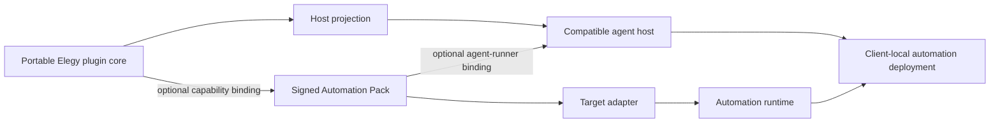

# Automation Portability Handoff

## Current status

The canonical terminology boundary landed on 2026-07-15. Automation Pack
delivery contracts continue to incubate in `elegy-automation-forge`; no Pack
schema, native workflow authority, target adapter, or client deployment state
has moved into Elegy.

## Goal

Clarify the boundary between portable Elegy capability plugins and separately
owned automation packs without implementing an automation engine in Elegy.

## Accepted boundary

- [Canonical terminology](../architecture/terminology.md) defines portable
  plugin core, host projection, capability binding, Automation Pack, target
  adapter, agent-runner binding, automation deployment, and Automation Forge.
- An Elegy plugin is an optional capability dependency, not the root of every
  Automation Pack.
- Keep native workflow graphs and client operation above the Elegy substrate.
- Require Elegy + current-compatible Codex; require explicit conformance for
  other host and target claims.
- Automation Forge owns delivery and adapter contracts outside
  Elegy, including a separable installer protocol, while Elegy remains the
  plugin and capability authority.

## Remaining adoption work

- Record the durable ADR that the current Automation Forge Pack v2 contracts
  incubate in `elegy-automation-forge` and become eligible for core promotion
  only after two unrelated conforming Packs.
- Add a governed fixture proving isolated host extensions remain projections.
- Update compatibility specifications only when a public Pack-to-capability
  binding contract is ready for Elegy ownership.

## Non-goals

- n8n workflow schemas or execution.
- Forge implementation.
- Target and installation adapter protocols or installer execution.
- Client deployment, credentials, approvals, monitoring, or UI state.
- A universal workflow graph.
- Requiring every plugin to support every harness.

## Acceptance

- Terminology, topology, capability-catalog, Codex projection, and compatibility
  specs remain mutually consistent.
- Architecture, ADR, specification, planning, roadmap, research, and generated
  documentation roots are explicitly classified.
- Existing plugin SDK/tooling tests and documentation validation pass.
- No current plugin loses compatibility.
