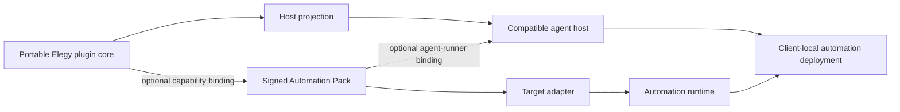

# Automation Portability Handoff

## Current status

This handoff is preserved as historical evidence from 2026-07-15. The current
portfolio authority is the [canonical Overseer automation strategy](https://github.com/Sofreshx/Overseer/blob/main/docs/portfolio/automation-agent-delivery-strategy.md).
No Automation Program, Forge, or Care document is current authority for Elegy,
and no target-native workflow or client deployment state belongs in this
repository.

## Goal

Clarify the boundary between portable Elegy capability plugins and separately
owned automation packs without implementing an automation engine in Elegy.

## Accepted boundary

- [Canonical terminology](../architecture/terminology.md) defines portable
  plugin core, host projection, capability binding, and the historical Pack and
  target-adapter terms used by older delivery work.
- An Elegy plugin is an optional capability dependency, not the root of every
  Automation Pack.
- Keep native workflow graphs and client operation above the Elegy substrate.
- Require Elegy + current-compatible Codex; require explicit conformance for
  other host and target claims.
- Current target-native solution repositories own delivery and adapter
  behavior outside Elegy, while Elegy remains the plugin and capability
  authority. The archived Forge implementation is preserved only as history.

```mermaid
flowchart LR
    Core["Portable Elegy plugin core"] --> Projection["Host projection"]
    Projection --> Host["Compatible agent host"]
    Core -->|"optional capability binding"| Pack["Signed Automation Pack"]
    Pack --> Adapter["Target adapter"]
    Adapter --> Target["Automation runtime"]
    Pack -->|"optional agent-runner binding"| Host
    Host --> Deployment["Client-local automation deployment"]
    Target --> Deployment
```

## Remaining adoption work

- Do not promote the historical Forge/Pack contracts into Elegy. Reconsider a
  small reusable capability only after repeated real target-native deliveries
  prove a stable boundary and the Overseer strategy authorizes it.
- Add a governed fixture proving isolated host extensions remain projections.
- Update compatibility specifications only when a public Pack-to-capability
  binding contract is ready for Elegy ownership.

## Non-goals

- n8n workflow schemas or execution.
- Forge implementation.
- Target and installation adapter protocols or installer execution.
- Client deployment, credentials, approvals, monitoring, or UI state.
- A universal workflow graph.
- Requiring every plugin to support every harness.

## Acceptance

- Terminology, topology, capability-catalog, Codex projection, and compatibility
  specs remain mutually consistent.
- Architecture, ADR, specification, planning, roadmap, research, and generated
  documentation roots are explicitly classified.
- Existing plugin SDK/tooling tests and documentation validation pass.
- No current plugin loses compatibility.
