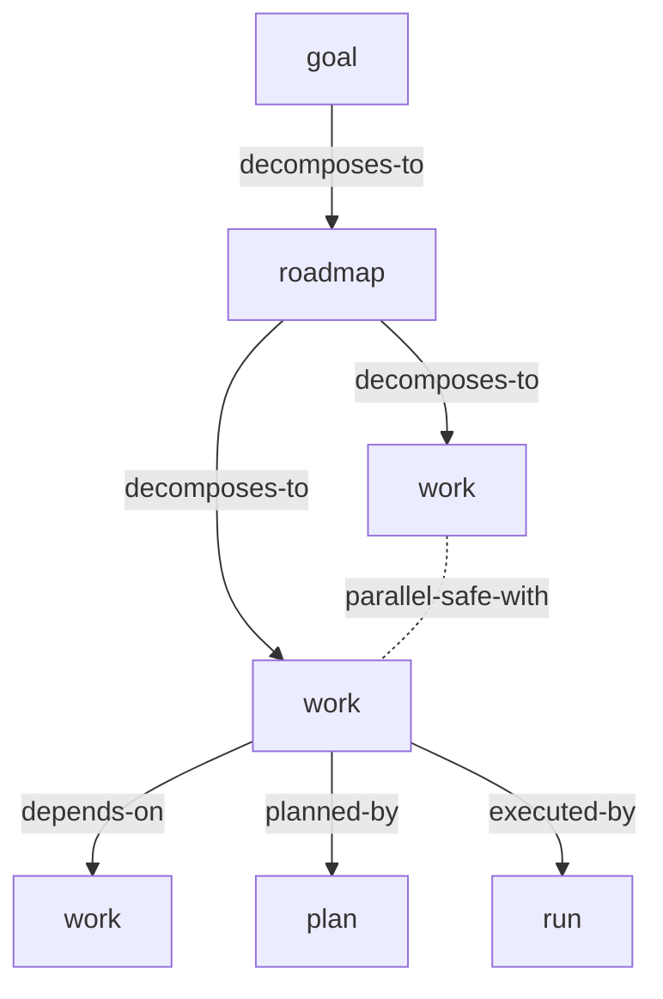

# elegy-planning graph core

## Problem

The current `elegy-planning` entity model is too linear for complex agent work.
It can represent a roadmap with work-point dependencies, but it cannot cleanly
express cross-cutting work, optional roadmap lenses, many-to-many acceptance
coverage, run trace history, repeated fix attempts, or parallel-safe work groups
without adding special cases around the hierarchy.

## Goals

- Make a typed graph the durable authority for planning state.
- Preserve familiar planning concepts as node kinds: goal, roadmap, milestone,
  work, plan, task, run, issue, review, insight, acceptance, and evidence.
- Represent decomposition, dependency, blocking, repair, supersession,
  acceptance, execution, and evidence relationships as typed edges.
- Keep roadmaps useful as optional strategic lenses for complex branching work.
- Support compatibility migration from the v1 goal/roadmap/work-point/plan model.

## Non-Goals

- Do not expose arbitrary graph mutation as the normal agent API.
- Do not replace `elegy-memory`; planning traces are active work state, while
  memory remains distilled retrospective knowledge.
- Do not make roadmap nodes mandatory for simple goals.
- Do not implement a remote scheduler or decide which host actually runs agents.

## Behavior

The authority tables are `planning_nodes` and `planning_edges`.

`planning_nodes` stores common graph metadata:

- stable node id, scope key, node kind, title, summary/body, lifecycle status,
  typed payload JSON, tags, revision, created/updated timestamps

`planning_edges` stores governed relationships:

- stable edge id, scope key, edge kind, source node id, target node id, typed
  payload JSON, lifecycle status, revision, created/updated timestamps

Initial node kinds:

| Kind | Purpose |
|---|---|
| `goal` | High-level intent and strategic success target |
| `roadmap` | Optional branching/phase lens for complex work |
| `milestone` | Intermediate phase, branch, or convergence point |
| `work` | Agent-runnable unit of work |
| `plan` | Session recipe for executing one or more work nodes |
| `task` | Smaller checklist step under a plan or work node |
| `run` | Execution attempt/session trace node |
| `acceptance` | Abstract or concrete requirement |
| `evidence` | Typed proof or reference |
| `issue` | Problem, blocker, or defect |
| `review` | Review finding or review point |
| `insight` | Reasoning artifact attached to graph context |

Initial edge kinds:

| Kind | Meaning |
|---|---|
| `decomposes-to` | Source is broken into target |
| `depends-on` | Source is not runnable until target completes |
| `blocks` | Source prevents target from running while active |
| `parallel-safe-with` | Optional hint that two nodes are known safe together |
| `planned-by` | Work is executed through a plan |
| `executed-by` | Work or plan is executed by a run |
| `contains` | Run contains turn summaries, attempts, or command results |
| `requires` | Node requires an acceptance criterion |
| `satisfies` | Concrete acceptance covers abstract acceptance |
| `evidenced-by` | Acceptance, fix, or run has evidence |
| `found` | Run/attempt discovered an issue or review finding |
| `addressed-by` | Finding is addressed by a fix/work node |
| `repairs` | Source corrective work repairs target |
| `supersedes` | Source replaces target |

The graph is flexible but governed:

- decomposition and dependency subgraphs must be acyclic
- edge kinds constrain valid source and target node kinds
- cross-scope edges are rejected unless an explicit future cross-scope bridge
  spec defines them
- resource conflicts are represented on node payloads or edge payloads and used
  by runnable/parallel queries
- generic graph mutation is reserved for migration and administrative tooling

Graph query commands must support:

- ancestors and descendants by edge family
- runnable work nodes with reasons
- blocked work nodes with blocker paths
- parallel-safe groups with conflict explanations
- acceptance coverage paths
- run trace and finding history for context bundles

## Compatibility Migration

Existing records migrate into graph nodes and edges:

| v1 record | graph representation |
|---|---|
| Goal | `goal` node |
| Roadmap | `roadmap` node plus `goal decomposes-to roadmap` edge |
| RoadmapSection | `milestone` node or section payload, depending on fidelity needs |
| WorkPoint | `work` node plus decomposition and dependency edges |
| Plan | `plan` node plus `work planned-by plan` edges |
| Todo | `task` node under plan/work |
| ProjectRun | `run` node linked by `executed-by` |
| Issue / ReviewPoint / Insight | same-kind graph nodes with attachment edges |

Old typed commands should remain as compatibility aliases during a transition
window, implemented by graph command handlers rather than by writing legacy
tables directly.

## Acceptance Criteria

- [ ] A graph schema can represent the current v1 planning hierarchy without
  losing IDs, lifecycle state, validation references, tags, or evidence refs.
- [ ] Dependency and decomposition cycles are rejected before write.
- [ ] Runnable work queries return candidates, blockers, and reasons from graph
  state only.
- [ ] Parallel group queries account for dependencies, blockers, and declared
  resource conflicts.
- [ ] Roadmaps are optional; a simple goal may decompose directly to work.
- [ ] Old v1 commands have compatibility aliases that write through graph
  command handlers.

## Validation

- Add migration tests from v1 fixture databases to graph records.
- Add graph invariant tests for cycle rejection, invalid edge kinds, and
  cross-scope references.
- Add query tests for runnable candidates, blocker paths, and parallel groups.
- Run `cargo test -p elegy-planning` after implementation.

## Links

- [Adopt elegy-planning graph core ADR](../adr/2026-06-15-adopt-elegy-planning-graph-core.md)
- [Deterministic state machine spec](elegy-planning-state-machine.md)
- [Acceptance and evidence spec](elegy-planning-acceptance-evidence.md)
- [Run trace and context spec](elegy-planning-run-trace-context.md)
- [elegy-planning v1 spec](elegy-planning.md)
