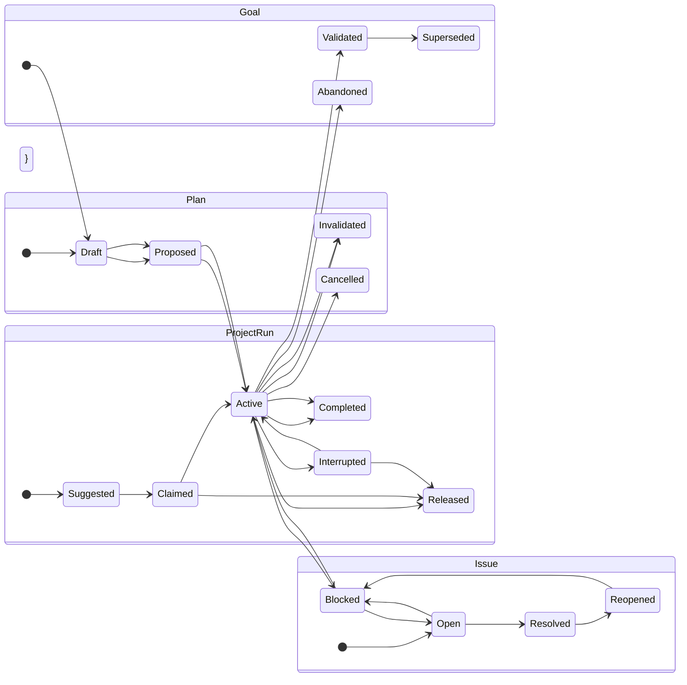
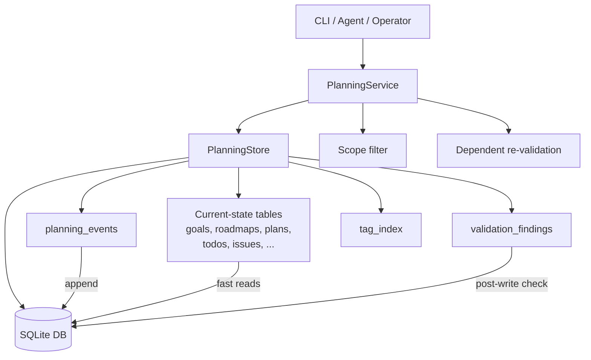
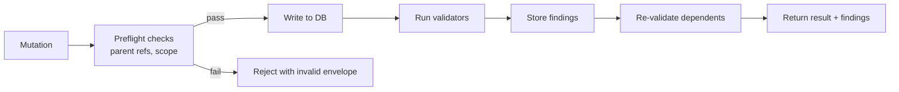
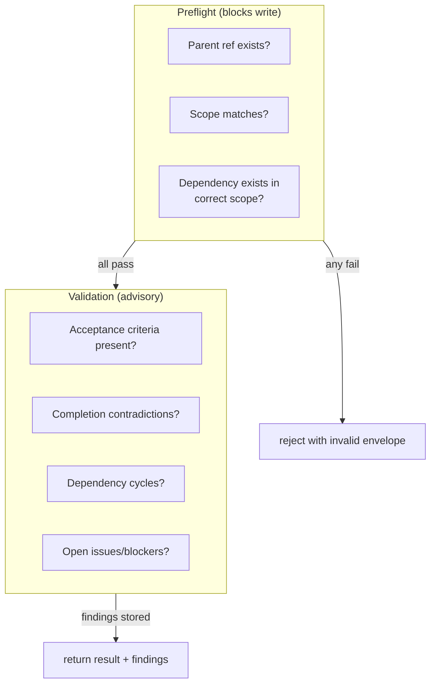
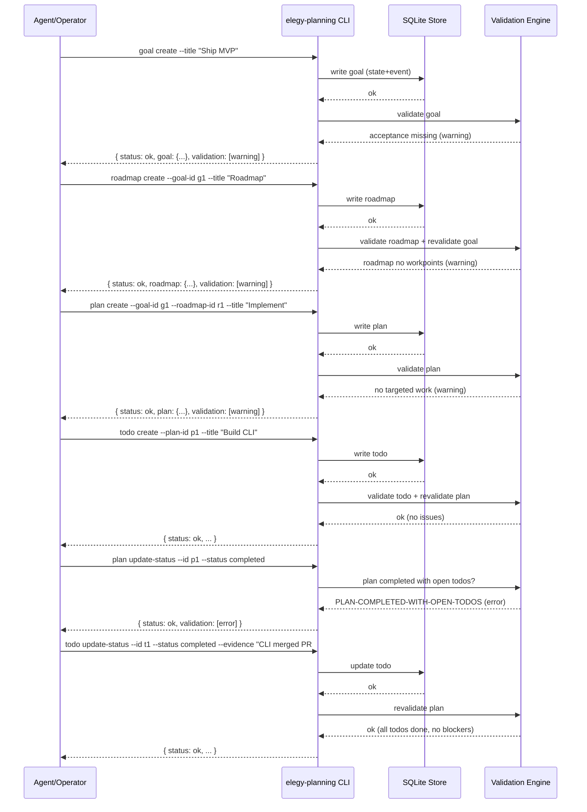
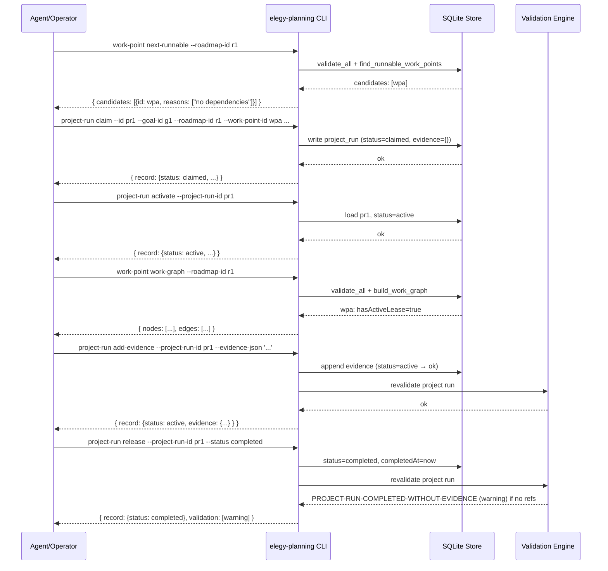

# elegy-planning: Durable Planning Authority

## Problem

Before `elegy-planning`, Elegy had two overlapping but underspecified planning surfaces: unqueryable Markdown roadmaps under `docs/roadmaps/` and retrospective-only observations in `elegy-memory`. Forward-looking execution intent — goals, plans, validation — had no structured, queryable, programmatically traversable home.

See [What and Why](#what-and-why) for the full problem breakdown.

## Goals

1. Provide a standalone CLI and SQLite-backed store for durable planning state: goals, roadmaps, plans, todos, issues, review points, insights, validation findings, and event history.
2. Ensure deterministic validation with automated checks on every write.
3. Enforce scope isolation between workspace, user, agent, and session scopes.
4. Produce machine-first JSON output with versioned envelopes and correlation IDs.
5. Keep state queryable via SQL, FTS5 full-text search, and tag indexes.

## Non-Goals

- Do not replace `elegy-memory`. Planning addresses forward execution intent; memory handles distilled retrospective observations. See [Relationship to elegy-memory](#relationship-to-elegy-memory).
- Do not enforce lifecycle state transitions at the type level in the MVP (deferred to v1).
- Do not provide event replay or subscription/push APIs in the MVP.
- Do not auto-score prose quality or architectural soundness.
- Do not provide compatibility import from `instruction-engine` Markdown conventions.

See [Critical Analysis](#critical-analysis) for a full discussion of scope boundaries and deferred features.

## What and Why

`elegy-planning` is a standalone CLI and SQLite-backed store for durable planning state:
goals, roadmaps, plans, todos, issues, review points, insights, validation findings,
and event history.

### The Problem It Solves

Before `elegy-planning`, Elegy had two overlapping but underspecified planning surfaces:

1. **Markdown planning docs** under `docs/roadmaps/` — human-readable, version-controlled,
   but unqueryable, unvalidatable, and impossible to traverse programmatically. A roadmap
   doc might describe a goal; nothing ensures the goal has acceptance criteria, nothing
   warns when a plan completes with open todos, and nothing links a plan back to its
   roadmap at the data level.

2. **`elegy-memory`** stores *distilled observations about what happened* — facts,
   decisions, context. It is not designed for *intent and forward progress*: you don't
   store "this plan is blocked because" in memory; you store the issue and the validated
   state transition.

The gap is forward-looking, structured, queryable execution intent — the kind of state
that a host agent or human operator needs to understand "what are we working on, where
are we stuck, and is this ready to ship?"

`elegy-planning` fills that gap with:

- **Deterministic validation** — a plan that says it's complete but has open high-severity
  issues gets flagged automatically, every time.
- **Stable IDs and correlation** — every entity has a stable key, every mutation is
  correlated via session or explicit correlation ID, and the event log preserves a
  full audit trail.
- **Scope isolation** — workspace, user, agent, and session scopes do not cross-query
  by default, mirroring the same guardrail `elegy-memory` uses.
- **Machine-first output** — `--json --non-interactive` on every command, structured
  envelopes with schema versioning, so LLMs and harness code consume the output without
  scraping text.

### Why Not Just Use Markdown?

| Concern | Markdown | elegy-planning |
|---|---|---|
| Queryability | `grep` or eyeball | SQL, FTS5, tag index, filters |
| Validation | Manual proofreading | 34 automated checks per write |
| Cross-entity links | Text references, no enforcement | Preflight-gated, validation-checked |
| Status transitions | Convention-based, no enforcement | Governed lifecycle statuses |
| Audit trail | Git blame | `planning_events` with correlation IDs |
| Scope isolation | Directory conventions | Enforced at storage layer |
| Machine consumption | Parse errors, schema drift | Versioned JSON envelope |

### Relationship to elegy-memory

```
┌─────────────────────────────┐     ┌─────────────────────────────┐
│        elegy-memory         │     │       elegy-planning        │
│                             │     │                             │
│  Distilled observations     │     │  Forward execution intent   │
│  about what happened:       │     │  and progress state:        │
│  facts, decisions, context  │     │  goals, roadmaps, plans     │
│                             │     │                             │
│  "We chose SQLite because"  │     │  "Goal: ship MVP by June"   │
│  "The deployment failed"    │     │  "Plan: blocked on CI"      │
│                             │     │                             │
│  Past / retrospective       │     │  Present + future / intent  │
└─────────────────────────────┘     └─────────────────────────────┘
```

They are independent systems that serve complementary roles. A plan reaching completion
might produce a memory observation about what was learned; a memory about a failed
approach might inform why a goal was invalidated. But neither replaces the other.

## Behavior

`elegy-planning` exposes deterministic CRUD and validation commands through a CLI with structured JSON output. Every mutation goes through a preflight gate (parent refs, scope match), writes current state and events to SQLite atomically, then runs advisory validators. The write is never rolled back on validation failure — invalid state still exists but carries a `validation` payload describing what is wrong.

Every command supports the machine envelope: versioned schema, correlation ID, non-interactive flag, structured data, typed errors.

See [CLI Interface](#cli-interface) for the full command reference and [Write Path](#write-path) for the mutation pipeline.

## Acceptance Criteria

- [x] `elegy-planning --help` lists all commands with descriptions
- [x] `goal create --title "MVP"` produces a goal with a stable ID and stored validation findings
- [x] `plan create --goal-id <id> --roadmap-id <id>` enforces goal-roadmap match at preflight
- [x] `validate all` reports all validation findings without side effects
- [x] `--json` on every command produces a valid versioned envelope

## Validation

```
cargo test -p elegy-planning
```

The validation engine runs automatically after every mutation. See [Validation Engine](#validation-engine) for the full rule set and [Appendix: Example Workflow](#appendix-example-workflow) for a walkthrough.

## Links

- Source crate: `rust/crates/elegy-planning/`
- Spec: This document
- Architecture: [elegy-planning-v1](../architecture/elegy-planning-v1.md)

---

## Entity Model

### Hierarchy

```
Scope (isolates all entities below)
 │
 ├── Goal                         (acceptance + rejection criteria)
 │    └── Roadmap                 (linked to exactly 1 goal)
 │         ├── Section            (structural grouping)
 │         └── WorkPoint          (durable item, may have dependencies)
│              └── ProjectRun    (execution lease, attached to one work point)
 │
 ├── Plan                         (single execution pass, links to 1 goal + 1 roadmap)
 │    ├── Todo                    (linked or standalone; evidence_refs)
 │    └── ReviewPoint             (lightweight review, attached to any entity)
 │
 ├── Issue                        (first-class aggregate, linked to entities)
 ├── Insight                      (first-class reasoning artifact, attached to entities)
 │
 └── PlanningEvent                (append-only log of all mutations)
```

### Entity Lifecycles

Each entity type has a governed set of allowed lifecycle statuses. Transitions are not
yet enforced at the type level (v1 feature), but the stored values are constrained.



### Key Relationship Rules

| Rule | Enforcement |
|---|---|
| Every roadmap must link to a goal | Preflight check before insert |
| A plan's goal must match its roadmap's goal | Validation finding (`PLAN-GOAL-ROADMAP-MISMATCH`) |
| Completion when work remains open | Validation finding (error severity) |
| Standalone todos (no plan, no work point) | Validation finding (warning severity) |
| Completed todos without evidence | Validation finding (warning severity) |
| Insight must have a resolvable parent entity | Validation finding (`INSIGHT-NO-PARENT`, error severity) |
| Cross-scope parent references | Rejected at preflight |
| Scope transfer leaves dependent entities | Rejected at preflight |
| ProjectRun must link to a goal, roadmap, and work point | Preflight check before insert |
| Active ProjectRun lease on a work point blocks other claims | Preflight rejection (`ACTIVE-LEASE-CONFLICT`) |
| Work point with active lease is excluded from `next-runnable` | Read-side filter |
| `add-evidence` rejected when run is `completed` or `released` | Status check at preflight |
| Completed project run with no evidence refs | Validation finding (`PROJECT-RUN-COMPLETED-WITHOUT-EVIDENCE`, warning) |
| Project run attached to a cancelled or invalidated work point | Validation finding (`PROJECT-RUN-WORK-POINT-INVALID`, error) |
| Project run attached to a goal that is invalidated, superseded, or abandoned | Validation finding (`PROJECT-RUN-GOAL-NOT-ACTIVE`, warning) |

---

## Storage Architecture



### Write Path

```
Mutation command
  → Service scope check
    → Preflight parent references
      → SQLite write (current state + event append)
        → Validation engine runs
          → Dependent entities re-validated
            → Results stored in validation_findings
              → Output envelope returned
```

The write is **not** rolled back if validation finds errors — the system intentionally
separates core schema validity from planning soundness. An invalid plan still exists
in the database; it just carries a `validation` payload with the list of things wrong.

### Read Path

```
Query command
  → Service scope check
    → SQLite read (current-state tables)
      → Optional: join validation_findings
        → Output envelope returned
```

Reads go through current-state tables, not the event log. The event log exists for
audit, replay, and debugging, not for serving queries.

### Event Model

Every successful write (create, update-status, revise, etc.) appends a row to
`planning_events` with:

| Field | Purpose |
|---|---|
| `event_id` | Unique event identifier |
| `scope_key` | Scope in which this event occurred (resolved at insert) |
| `entity_type` + `entity_id` | What changed |
| `aggregate_type` + `aggregate_id` | The owning aggregate (e.g., a goal's aggregate is itself) |
| `correlation_id` | Links events across a session or operation |
| `causation_id` | Optional causal link for event chains |
| `run_id` | Specific execution attempt |
| `stream_id` + `sequence` | Stream-local ordering |
| `parent_event_id` | Optional causal parent |
| `event_type` | Event kind, e.g. `goal.created`, `plan.revised` |
| `timestamp` | ISO 8601 timestamp |
| `payload_json` | Full record snapshot at time of event |

Events are stored but not yet replayable to reconstruct state independently. The MVP
writes both events and projections together; replay-only reconstruction is v1 scope.

---

## CLI Interface

### Posture

Every command supports the machine envelope:

```json
{
  "schemaVersion": "planning-result/v1",
  "correlationId": "corr-abc-123",
  "nonInteractive": true,
  "command": ["goal", "create"],
  "status": "ok",
  "data": { "goal": { "id": "goal-1", ... }, "validation": [...] },
  "error": null
}
```

Status values: `ok`, `invalid` (preflight rejection, e.g. missing parent), `error`
(runtime failure).

Exit codes: 0 (success), 1 (invalid input), 2 (runtime failure).

### Session Model

`elegy-planning session init` creates `~/.elegy/planning-session.json` with a UUID
session ID, scope, and timestamps. Once active, all mutation commands auto-correlate
via the session ID without needing `--correlation-id` on every call.

### Commands (MVP)

| Category | Commands |
|---|---|
| Scope | `create`, `list`, `show` |
| Goal | `create`, `list`, `show`, `update-status`, `search` |
| Roadmap | `create`, `add-section`, `add-work-point`, `list`, `show`, `update-status`, `search` |
| Work point | `list`, `show`, `update-status`, `next-runnable`, `work-graph` |
| Plan | `create`, `list`, `show`, `revise`, `update-status`, `search` |
| Todo | `create`, `list`, `update-status`, `search` |
| Issue | `record`, `list`, `show`, `update-status`, `search` |
| Review point | `record`, `update-status` |
| Insight | `record`, `list`, `show`, `search`, `update-status` |
| Context | `--entity-type <type> --entity-id <id>` \| `--session` (progressive disclosure bundles) |
| Tags | `list` (tag governance) |
| Search | cross-entity `search`, entity-specific `* search` |
| Validate | `all` |
| Health | `health` |
| Events | `events` |
| Project | `render`, `export` |
| Project run | `claim`, `activate`, `release`, `add-evidence`, `list`, `show` |

---

## Validation Engine

Validation is advisory-first: findings steer without blocking writes.



### Implemented Validators

| Code | Severity | Condition |
|---|---|---|
| `GOAL-ACCEPTANCE-MISSING` | Warning | Goal has no acceptance criteria |
| `GOAL-REJECTION-MISSING` | Warning | Goal has no rejection criteria |
| `GOAL-VALIDATED-WITHOUT-ROADMAP` | Warning | Goal validated but has no roadmaps |
| `ROADMAP-NO-WORK-POINTS` | Warning | Roadmap has no work points |
| `ROADMAP-GOAL-NOT-ACTIVE` | Error | Roadmap links to an invalidated, superseded, or abandoned goal |
| `ROADMAP-COMPLETED-WITH-OPEN-WORK` | Error | Roadmap completed but work points remain non-completed |
| `ROADMAP-SECTION-EMPTY` | Warning | Roadmap section has no work points |
| `WORK-POINT-SECTION-MISMATCH` | Error | Work point section belongs to a different roadmap |
| `WORK-POINT-SECTION-MISSING` | Error | Work point references a missing roadmap section |
| `WORK-POINT-NO-VALIDATION` | Warning | Work point has no validation expectations |
| `WORK-POINT-DEPENDENCY-CROSS-ROADMAP` | Error | Dependency belongs to a different roadmap |
| `WORK-POINT-DEPENDENCY-MISSING` | Error | Dependency does not exist |
| `WORK-POINT-DEPENDENCY-CYCLE` | Error | Dependency graph contains a cycle |
| `WORK-POINT-COMPLETED-WITH-OPEN-DEPENDENCY` | Error | Completed work point depends on non-completed work point |
| `PLAN-GOAL-ROADMAP-MISMATCH` | Error | Plan's goal does not match its roadmap's goal |
| `PLAN-NO-TARGETED-WORK` | Warning | Plan does not target any work points |
| `PLAN-NO-VALIDATION-STEPS` | Warning | Plan does not define validation steps |
| `PLAN-NO-TODOS` | Warning | Plan has no todo records |
| `PLAN-WORK-POINT-ROADMAP-MISMATCH` | Error | Targeted work point belongs to a different roadmap |
| `PLAN-WORK-POINT-MISSING` | Error | Targeted work point does not exist |
| `PLAN-COMPLETED-WITH-OPEN-TODOS` | Error | Plan completed but todos remain incomplete |
| `PLAN-BLOCKING-ISSUES` | Error | Unresolved high-severity or critical issues attached |
| `PLAN-OPEN-REVIEW-POINTS` | Error | Unresolved high-severity or critical review points |
| `TODO-STANDALONE` | Warning | Todo linked to no plan or work point |
| `TODO-COMPLETED-WITHOUT-EVIDENCE` | Warning | Completed todo has no evidence references |
| `TODO-PLAN-WORK-POINT-MISMATCH` | Warning | Todo links to both a plan and work point, but the plan does not target that work point |
| `ISSUE-PARTIAL-ENTITY-LINK` | Warning | Only one of entity type / entity id is set |
| `ISSUE-RELATED-ENTITY-MISSING` | Error | Related entity does not exist |
| `ISSUE-BLOCKED-LOW-SEVERITY` | Warning | Blocked issue should be at least medium severity |
| `REVIEW-POINT-ATTACHED-ENTITY-MISSING` | Error | Attached entity does not exist |
| `REVIEW-POINT-CRITICAL-OPEN` | Warning | Critical review point remains open |
| `INSIGHT-EMPTY-CONTENT` | Error | Insight content must not be empty |
| `INSIGHT-TAG-ORPHAN` | Warning | Insight has no tags; add tags for discoverability |
| `INSIGHT-NO-PARENT` | Error | Insight references a missing parent entity |
| `PROJECT-RUN-COMPLETED-WITHOUT-EVIDENCE` | Warning | Project run is completed but has no evidence refs |
| `PROJECT-RUN-WORK-POINT-INVALID` | Error | Project run is attached to a cancelled or invalidated work point |
| `PROJECT-RUN-GOAL-NOT-ACTIVE` | Warning | Project run references a goal that is no longer active |

---

## Critical Analysis

### What Works Well

1. **Separation of concerns from memory is correct.** Forward intent and retrospective
   observation are fundamentally different storage patterns with different query shapes,
   consistency requirements, and validation needs. Combining them would produce a worse
   system for both use cases.

2. **Advisory-first validation is the right call for an LLM-operated tool.** An agent
   that gets a hard block on every incomplete validation will either stall out or learn
   to work around the system. Storing findings and surfacing them on read keeps the
   feedback loop tight without breaking flow.

3. **Scope isolation mirrors memory's guardrails**, which means host agents that already
   understand `elegy-memory` scopes get planning scopes for free. Cross-scope leakage
   is prevented at the storage layer, not by convention.

4. **Event append on every mutation** gives a free audit trail without requiring a
   separate audit system. The correlation ID linking is especially valuable for
   multi-turn LLM sessions where you need to reconstruct what happened and why.

5. **Machine output envelope is versioned and structured**, which is the minimum bar
   for reliable LLM consumption. The `planning-result/v1` schema version gives a
   migration path.

### Design Risks and Issues

1. **The entity hierarchy introduces coupling risk.** A plan links to both a goal and
   a roadmap, and the goal must match. This is correct for the MVP use case (one
   plan → one goal → one roadmap), but doesn't cleanly map to multi-goal programs
   or cross-cutting work. A plan that touches two goals currently cannot be modeled
   without creating a synthetic aggregate goal or duplicating the plan. This is a
   modeling leak that will surface as the system gets used for real cross-cutting work.

2. **Validation findings are advisory but stored alongside authoritative data.**
   This creates ambiguity about what the "source of truth" is for a given entity's
   status. If validation says "invalid" but the database says "active", which does a
   downstream consumer trust? The architecture doc is clear that the DB is authoritative,
   but in practice consumers will cargo-cult the validation status. This needs explicit
   guidance or a `PlanView.status` computed from both the lifecycle and the validation
   findings.

3. **No lifecycle transition enforcement.** Valid status values are constrained per
   entity type, but the system does not enforce valid transitions (e.g., it allows
   `Draft → Completed` skipping `Active`). This was explicitly deferred to v1, which
   is fine, but it means the status field is closer to a free-text tag than a state
   machine until the enforcement lands. Anyone building workflow logic on top has to
   handle impossible transitions themselves.

4. **SQLite-as-authority has a synchronization problem.** There's no push mechanism
   when the database changes. An agent running `elegy-planning` in one session has no
   way to observe that another session modified the same scope unless it polls.
   This is fine for single-agent or single-session workflows but breaks down with
   concurrent agent teams. The event log could be polled, but there's no subscription
   API. This is a hard problem, but it should be documented as a known limitation.

5. **Event log is append-only but not replayable.** The MVP writes both events and
   current-state projections atomically, but there's no `replay` command to rebuild
   state from events alone. This means the event log is useful for audit but useless
   for recovery. If the current-state tables get corrupted, the events alone won't
   save you. This is explicitly flagged as v1 scope in `mvp-scope.md`, which is honest,
   but it's worth noting because it means the events are decorative until that lands.

6. **Tag + FTS combination is not independently testable via CLI.** The underlying
   `search_entity` function correctly combines `tag` and `fts` as AND subqueries, and
   `search_all` delegates to per-entity search which propagates both filters. The
   combination works, but it's not covered by integration tests, and the output envelope
   doesn't indicate which filter matched each result. For observability, the CLI should
   report which search criteria produced each result row.

7. **The `plan revise` command is a single scope-transfer operation**, but there's
   no batch scope-migration command. Moving a plan from `user/alice` to `workspace/bob`
   requires individually updating dependent entities or being blocked by the preflight
   check. This is correct for safety but painful in practice.

8. **Token estimates in context bundles** are a novel idea (estimating how many tokens
   a bundle consumes for LLM context windows), but the estimate method isn't documented
   or tested. If the estimate is wrong by more than a small margin, LLMs will either
   waste context or get truncated mid-entity. The feature is useful but needs
   characterization.

9. **No compatibility import from `instruction-engine`.** The README and architecture
   doc both acknowledge this, but it means anyone migrating from the earlier markdown
   roadmap convention has to manually recreate their state. Until the bridge exists,
   adoption requires a one-time migration script that doesn't exist.

10. **FTS5 index is only built on entity create, not on update.** If you create a
    goal, then edit its description (via a hypothetical future update command), the
    FTS5 index won't reflect the new content. This is flagged in the gaps list.

### Would I Recommend This Approach?

Yes, with caveats. The core architecture is sound: separate planning from memory,
use SQLite as a pragmatic single-file authority, validate without blocking, structure
output for machines. These are the right bets for a tool that needs to survive across
LLM sessions and operator handoffs.

The risks are concentrated in three areas:

1. **Entity modeling rigidity** — the goal→roadmap→plan chain is too linear for
   real-world work. It works fine for the MVP scenarios described in
   `mvp-scope.md`, but real planning has cross-cutting goals, shared roadmaps,
   and plans that serve multiple masters. The model needs to accommodate this
   without forcing synthetic entities.

2. **Event log underutilization** — the events are stored with rich metadata, but
   they're not used for anything except listing. Until replay or subscriber patterns
   land, the event infrastructure is paying storage cost for no operational benefit.
   This is a natural MVP tradeoff but shouldn't stay this way past v1.

3. **No state machine enforcement** — this is the biggest practical risk. Without
   transition rules, `update-status` is semantically equivalent to setting a free-text
   tag. It works for display but not for workflow logic. The sooner transition
   enforcement lands, the more confidence consumers can have in the status field.

The top priority after MVP stabilization should be state machine enforcement for
lifecycle transitions (v1), followed by event replay (v1), then the cross-entity
modeling flexibility (v2).

---

## Appendix: Validation vs. Blocking



The preflight gate catches structural errors that would produce nonsensical data.
The validation engine catches planning errors that should be surfaced but shouldn't
prevent the operator from recording their current state and moving on.

---

## Appendix: Example Workflow



### Project Run Lease Workflow


