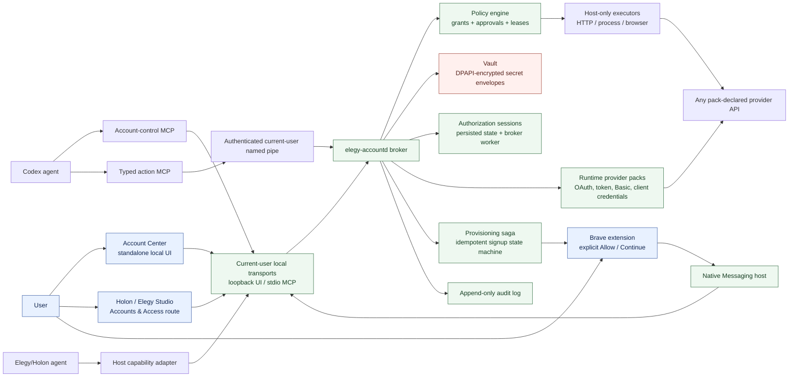
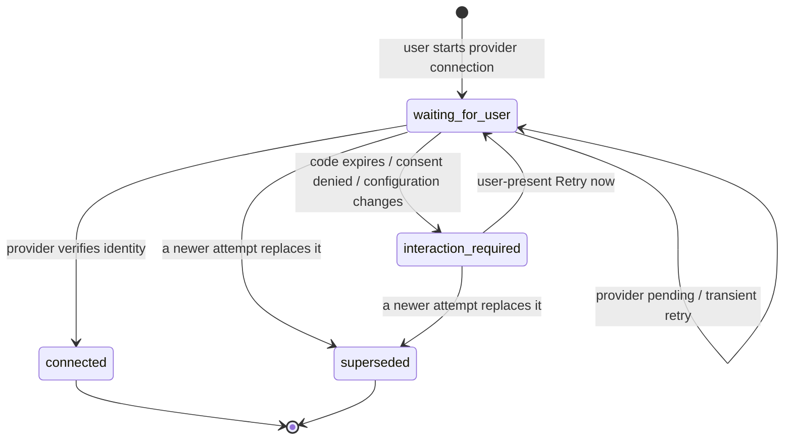

# Architecture

## Goal and scope

The MVP removes the friction of wiring accounts into agent workflows on one local Windows machine. It discovers relevant signed-in browser contexts, guides the user through safe connection or account creation, stores resulting credentials locally, and exposes revocable capabilities to Codex and Holon/Elegy Studio.

Team sharing, remote vault sync, centralized administration, billing delegation, CAPTCHA bypass, and unattended acceptance of legal or identity obligations are out of scope. A later team product may build on the stable broker contracts without weakening the local trust boundary.

## System diagram



## Trust and data flow

1. A registered local client asks for an account capability using a provider, purpose, requested operations, and optional account selector.
2. The broker resolves an existing account or returns a structured interaction requirement: discover, connect, approve, create, CAPTCHA, MFA, terms, payment, or identity verification.
3. The broker persists an authorization session before presenting it. OAuth uses authorization code with PKCE or device authorization where supported. Device polling and callback ownership remain in the broker, so closing Account Center cannot lose progress. Manual tokens are captured by trusted UI and sent only to the broker.
4. The vault encrypts secret material with a per-record data key; Windows DPAPI protects the key for the current user. Metadata contains no secret values.
5. The policy engine reuses a matching time-bounded read grant or creates a durable approval request. New typed execution keeps its short-lived single-use lease inside the broker.
6. A credential-free action host sends a signed typed operation over current-user local IPC. The broker validates the trusted operation definition, redeems the internal lease, performs the narrow action, and returns a sanitized result plus audit identifier.
7. Revocation invalidates grants and all derived leases immediately. Every security-relevant transition is appended to the audit log.

## Deterministic authorization lifecycle



Public session metadata contains the provider, user-facing code, verification URL, expiry, status, and sanitized error. The private device code is stored in a separate authenticated-encryption envelope protected by DPAPI and is deleted on completion, expiry, or supersession. The broker owns polling and resumes unexpired sessions after restart. Transient provider failures back off automatically; expiry never causes unattended consent churn and instead waits for an explicit user-present retry.

## Discovery, consent, and delegated action sequence

```mermaid
sequenceDiagram
  actor User
  participant Brave as Brave extension
  participant Center as Account Center
  participant Provider as Provider OAuth/API
  participant Broker as Local broker + vault
  participant Agent as Codex/Holon tool

  User->>Brave: Allow on recognized provider page
  Brave->>Broker: Native message with provider + origin hint only
  Broker-->>Brave: Open local Account Center
  Brave->>Center: Open ?connect=provider
  User->>Center: Confirm provider connection
  Center->>Provider: Authorization code + PKCE flow
  Provider-->>Broker: One-time authorization code
  Broker->>Provider: Exchange code; verify identity
  Broker->>Broker: Encrypt token with AES-GCM; protect key with DPAPI
  Broker-->>Center: Show verified account metadata

  Agent->>Broker: Request named operations + purpose
  Broker-->>Center: Pending access decision
  User->>Center: Approve limited duration
  Agent->>Broker: Invoke typed action (no credential or lease)
  Broker->>Broker: Validate client, grant, and issue internal single-use lease
  Broker->>Provider: Host-only API call with decrypted credential
  Provider-->>Broker: Provider response
  Broker-->>Agent: Sanitized result + audit ID
  User->>Center: Revoke
  Center->>Broker: Increment grant generation
  Broker-->>Agent: Existing lease rejected immediately
```

## Components

### Broker (`elegy-accountd`)

The broker is the sole authority for account metadata, secret envelopes, grants, leases, provisioning state, execution, and audit records. Account control uses MCP stdio, typed actions use a signed current-user Windows named pipe, Brave uses Native Messaging, and Account Center binds only to `127.0.0.1`. Client authentication keys and credentials are independently DPAPI-protected; neither is LLM-visible.

### Vault

Secrets use envelope encryption. The database stores ciphertext, nonce, algorithm version, and a DPAPI-protected data key. Decryption is allowed only inside broker execution paths. Backups contain encrypted envelopes plus metadata and can be restored only by the same Windows user unless explicitly exported through a future recovery flow.

### Provider packs and adapters

Runtime JSON packs declare auth methods, authorization metadata, safe discovery origins, credential fields, identity verification, and sanitized identity selectors. Pack v2 additionally declares typed operation risk, schemas, fixed profiles, and audience-relative HTTP recipes. Only bundled or explicitly trusted packs may execute; untrusted local packs remain enrollment-only. OAuth PKCE, device authorization, scoped tokens, HTTP Basic/app passwords, and client credentials use built-in audited adapters.

### Brave extension

The MV3 extension uses `activeTab` and exact-origin Native Messaging. It compares the active tab origin with the broker's sanitized runtime provider registry, then opens Account Center after explicit user action. It requests no host permissions and never reads Chrome/Brave password storage, exports cookies, or places tokens in extension storage.

### Provisioning saga

Signup is a persisted, idempotent state machine: requested, preflight, waiting_human, verifying, connected, failed, or cancelled. The first release provides safe navigation/handoff and resumable checkpoints; provider-specific form recipes can automate reversible fields later, but the state machine already forbids automated acknowledgement of CAPTCHA, MFA, terms, payment, KYC/identity, ambiguous plan selection, or unexpected content.

### Account Center and embed surface

One React component system powers a standalone local app and an embeddable route for Holon/Elegy Studio. It supports account inventory, connection/discovery, durable authorization attention, reopen/retry actions, grant review, request decisions, revocation, and activity counts. Backup and restore are supplied as local Windows commands in this release. The embedded surface changes navigation chrome only; authorization polling and security behavior remain broker-owned.

## Agent-facing contract

Account-control tools expose discovery, selection, access/creation requests, durable attention, presentation/resume/cancel, revocation, and sanitized audit reads. A separate action MCP exposes only trusted typed GitHub and Cloudflare reads. It carries neither credentials nor leases and cannot accept arbitrary HTTP requests. `account_present` remains the deterministic fallback for human interaction.

## Compatibility contract

Tool builders request named operations such as `dns.records.read` or `deployments.create`; they do not request raw scopes or credentials. Provider adapters map named operations to provider scopes and execution. This keeps account storage/auth separate from business-action design while enforcing compatibility at the grant boundary.
