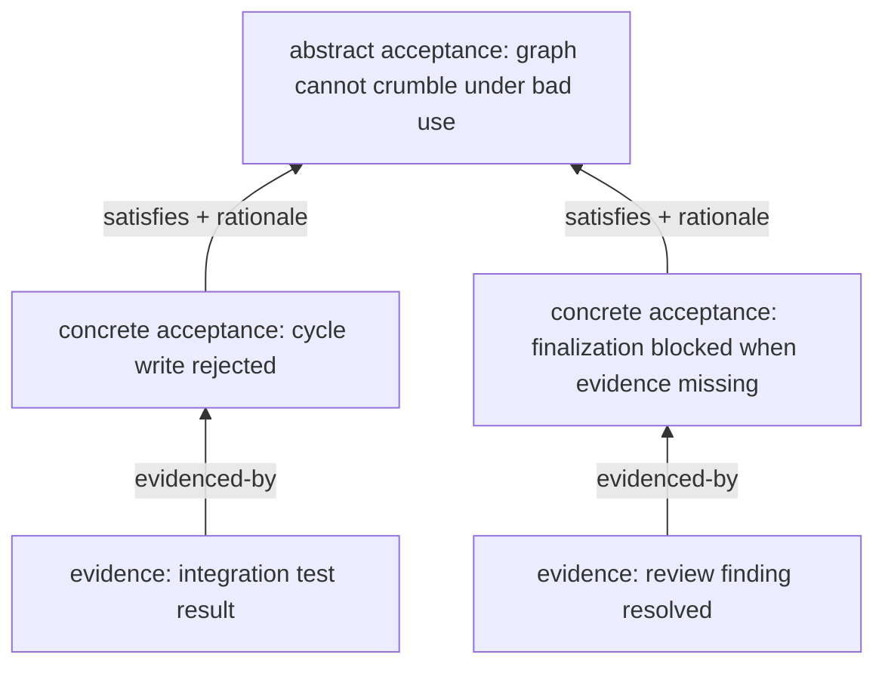

# elegy-planning acceptance and evidence

## Problem

Current acceptance criteria are mostly strings attached to goals or validation
expectations attached to work. That is not enough for complex agent planning:
high-level requirements are often abstract, lower-level proof must be concrete,
and reviewers need traceability from evidence back to the requirements it
claims to satisfy.

## Goals

- Represent acceptance criteria as first-class graph nodes.
- Distinguish abstract acceptance from concrete acceptance.
- Support many-to-many coverage links with rationale.
- Require concrete coverage and typed evidence before upstream finalization.
- Keep evidence typed without pretending every evidence kind proves the same
  thing.

## Non-Goals

- Do not auto-judge architecture correctness from evidence presence.
- Do not require all acceptance coverage before work can become active.
- Do not treat raw agent messages as proof unless captured as typed evidence or
  structured trace excerpts.

## Behavior

Acceptance nodes have:

- `acceptance_kind`: `abstract` or `concrete`
- title and description
- owner node or requiring node
- verification policy
- required evidence kinds
- lifecycle status

Abstract acceptance usually belongs to goals and roadmap nodes. It describes
qualities or outcomes that may not be directly executable, such as "the system
is deterministic under bad agent use" or "review context is sufficient for
repeat-fix analysis."

Concrete acceptance usually belongs to work nodes and plans. It describes
direct checks, evidence, or review outcomes, such as "dependency cycles are
rejected before write" or "review context bundle includes prior failed fixes."

Coverage uses `satisfies` edges from concrete acceptance to abstract
acceptance. Each edge must include rationale.

Initial evidence kinds:

| Kind | Meaning |
|---|---|
| `command-result` | Structured command execution result |
| `test-result` | Test, lint, typecheck, build, or validation result |
| `artifact-ref` | Path, hash, or generated artifact reference |
| `commit-ref` | Commit SHA or branch reference |
| `pr-ref` | Pull request URL or identifier |
| `review` | Human or agent review result |
| `trace-excerpt` | Structured excerpt from an agent turn or run trace |
| `external-url` | External reference URL |

Finalization gating:

- Work completion requires all required concrete acceptance for that work node
  to be satisfied or explicitly waived with rationale.
- Roadmap or goal validation requires abstract acceptance to have concrete
  coverage below it and required evidence for that coverage.
- Draft and active states remain flexible; coverage gaps are allowed until
  finalization.
- Accepted risk is allowed only for acceptance coverage/evidence gaps, not for
  malformed typed payloads. Type integrity and structural corruption are never waivable.

Evidence is not uniformly trusted. The verification policy on the acceptance
node decides which evidence kinds are required and whether evidence is
mandatory, advisory, or review-only.

## Acceptance Criteria

- [x] Abstract and concrete acceptance criteria round-trip as graph nodes.
- [x] Concrete acceptance can satisfy multiple abstract criteria with rationale.
- [x] Finalization rejects uncovered abstract acceptance.
- [x] Finalization rejects concrete acceptance with missing required evidence.
- [x] Evidence kinds are typed and queryable.
- [x] Accepted-risk paths require explicit rationale and event history.

## Implementation Notes

- Acceptance and evidence are stored as `PlanningNodeKind::Acceptance` / `Evidence`
  graph nodes in `planning_nodes`; no separate tables.
- Typed wrappers (`create_acceptance`, `create_evidence`, `satisfy_acceptance`,
  `attach_evidence`) construct payload JSON and delegate to `create_graph_node` /
  `create_graph_edge`.
- `acceptance_view` and `evidence_view` return active-only linked entities
  (inactive/proposed links are excluded).
- Validators emit warnings (`ACCEPTANCE-COVERAGE-MISSING`, `ACCEPTANCE-EVIDENCE-MISSING`,
  `ACCEPTANCE-RATIONALE-MISSING`, `ACCEPTANCE-KIND-INVALID`, `EVIDENCE-KIND-INVALID`).
- `graph node finalize` gates completion/validation on blocking findings:
  structural corruption (GRAPH-EDGE-*) is always blocked; type integrity violations
  (ACCEPTANCE-KIND-INVALID, EVIDENCE-KIND-INVALID) are always blocked;
  acceptance/evidence gaps (ACCEPTANCE-COVERAGE-MISSING, ACCEPTANCE-EVIDENCE-MISSING)
  are blocked unless `--accepted-risk` is provided.
- Accepted risk appends a `graph-node.finalized-with-accepted-risk` event with
  rationale in the payload.
- CLI surface: `graph acceptance create|show|list|satisfy`, `graph evidence
  create|show|list|attach`, `graph node finalize`.

## Validation

- Test many-to-many coverage links and rationale requirements.
- Test finalization gating for missing coverage and missing evidence.
- Test accepted-risk waiver behavior.
- Test evidence query by kind and by acceptance coverage path.
- Run `cargo test -p elegy-planning`.

## Links

- [Adopt elegy-planning graph core ADR](../adr/2026-06-15-adopt-elegy-planning-graph-core.md)
- [Graph core spec](elegy-planning-graph-core.md)
- [Deterministic state machine spec](elegy-planning-state-machine.md)
- [Run trace and context spec](elegy-planning-run-trace-context.md)
