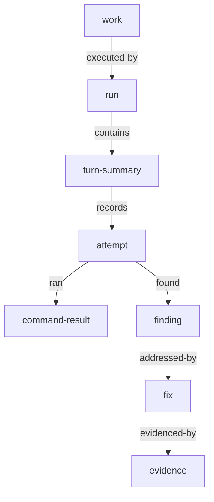

# elegy-planning run trace and context

## Problem

Agents need durable context about what happened during prior work: output
summaries, attempted fixes, review findings, unresolved issues, failed
validations, evidence, and repeated problem patterns. Raw transcripts are too
large and too unstructured to be the planning authority, while evidence-only
records lose important debugging and review context.

## Goals

- Store structured execution traces as graph state.
- Capture useful agent-turn output without storing raw full transcripts by
  default.
- Make reviews, issues, findings, fixes, commands, and evidence queryable.
- Provide bounded context bundles for workers, reviewers, fixers, planners, and
  validators.
- Preserve enough lineage to understand repeated fix attempts and recurring
  findings.

## Non-Goals

- Do not store raw full transcripts by default.
- Do not make `elegy-planning` responsible for terminal capture, browser
  automation, GitHub hosting, or external CI storage.
- Do not treat every agent output line as authoritative truth.

## Behavior

Runs are graph nodes linked to work and plans by `executed-by` or `planned-by`
edges. A run records execution attempts and structured trace children.

Trace node kinds:

| Kind | Purpose |
|---|---|
| `turn-summary` | Bounded summary of one agent turn or phase |
| `attempt` | A coherent attempt to implement, fix, review, or validate |
| `command-result` | Command, exit code, selected output, and artifact refs |
| `finding` | Issue or review finding with severity and lifecycle |
| `fix` | Attempted remedy for a finding |
| `evidence` | Typed proof linked to acceptance or fix |

Structured excerpts may include:

- summary of agent output
- decisions made
- files or resources touched
- commands run and important result lines
- issues found
- fix attempts and their outcomes
- validation evidence
- warnings, uncertainty, or residual risk

Raw full output can be stored only when a command or host explicitly requests a
raw artifact reference. Default trace storage should prefer summaries,
structured fields, and selected excerpts.

Review and issue findings are nodes, not annotations. A finding carries:

- severity
- lifecycle status
- affected work, plan, run, acceptance, or evidence links
- recurrence key or fingerprint
- discovery context
- resolution command history
- accepted-risk rationale, if any

Context bundles are derived read models. They are not separate authority.

| Bundle | Required content |
|---|---|
| worker | intent ancestors, dependencies, plan, concrete acceptance, resource locks |
| reviewer | evidence, open findings, prior findings, fix attempts, acceptance links |
| fixer | finding, failed attempts, affected resources, threatened acceptance |
| planner | goal, roadmap lenses, coverage gaps, blockers, runnable groups |
| validator | required acceptance, evidence, unresolved findings, dependent state |

Context loading must be bounded:

- accept a situation type and target node id
- include token or byte estimates where available
- include truncation warnings when output is reduced
- prefer recent active traces, unresolved findings, and directly connected
  acceptance/evidence paths

## Acceptance Criteria

- [ ] Runs store structured turn summaries, attempts, command results, findings,
  fixes, and evidence links.
- [ ] Review findings and issues have lifecycle state and recurrence keys.
- [ ] Fix attempts link to the finding they address and evidence they produce.
- [ ] Context bundle queries return situation-specific bounded data.
- [ ] Reviewer bundles include prior failed fixes and unresolved findings.
- [ ] Raw full transcripts are not stored by default.

## Validation

- Test run trace recording and retrieval by work node.
- Test finding recurrence and fix lineage queries.
- Test context bundles for worker, reviewer, fixer, planner, and validator
  situations.
- Test truncation warnings and token/byte estimate behavior.
- Run `cargo test -p elegy-planning`.

## Links

- [Adopt elegy-planning graph core ADR](../adr/2026-06-15-adopt-elegy-planning-graph-core.md)
- [Graph core spec](elegy-planning-graph-core.md)
- [Deterministic state machine spec](elegy-planning-state-machine.md)
- [Acceptance and evidence spec](elegy-planning-acceptance-evidence.md)
