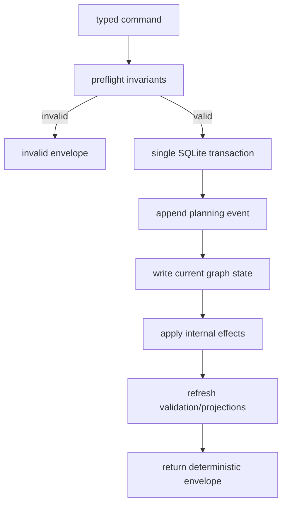

# elegy-planning deterministic state machine

## Problem

A flexible planning graph can fail if agents mutate it like generic CRUD state.
Clients should not need to remember follow-up writes for events, blockers,
coverage updates, trace links, projections, or context freshness. The system
must reject cleanly wrong transformations and apply internal planning side
effects itself.

## Goals

- Make typed command handlers the normal mutation API.
- Validate command preconditions before write.
- Apply state changes, event records, derived planning effects, and validation
  refreshes in one transaction.
- Return deterministic machine envelopes for success, invalid input, and runtime
  failure.
- Preserve explicit recovery paths for exceptional human or agent intervention.

## Non-Goals

- Do not make arbitrary SQL or generic graph mutation part of the normal agent
  workflow.
- Do not require host-side scheduling or approval policy beyond the side-effect
  class advertised by the CLI.
- Do not claim prose or architecture correctness from state-machine checks.

## Behavior

Every mutation follows this pipeline:

Typed command families:

| Family | Examples |
|---|---|
| Intent | `goal create`, `roadmap create`, `node decompose` |
| Work | `work create`, `work depend`, `work block`, `work complete` |
| Run | `run claim`, `run activate`, `run record-turn`, `run release` |
| Review | `review record-finding`, `finding resolve`, `finding reopen` |
| Acceptance | `acceptance create`, `acceptance link`, `acceptance verify` |
| Evidence | `evidence record`, `evidence attach` |
| Graph finalization | `graph node finalize` |
| Graph query | `graph runnable`, `graph parallel-groups`, `graph coverage` |

The state machine rejects impossible transformations before write:

| Operation | Required behavior |
|---|---|
| create dependency cycle | reject with `GRAPH_CYCLE` |
| complete work with unresolved critical finding | reject with `OPEN_CRITICAL_FINDING` |
| validate goal with uncovered abstract acceptance | reject with `ACCEPTANCE-COVERAGE-MISSING` |
| attach concrete acceptance to unrelated abstract acceptance without rationale | reject with `ACCEPTANCE-RATIONALE-MISSING` |
| finalize graph node with structural edge corruption | reject with `GRAPH-EDGE-*` (CYCLE, DUPLICATE-ACTIVE, MISSING-NODE, CROSS-SCOPE, KIND-MISMATCH) |
| finalize graph node with acceptance/evidence gaps | reject unless `--accepted-risk` provided; event records rationale |
| finalize graph node with malformed typed payloads | always reject; type integrity is never waivable |
| finalize abstract acceptance with no concrete coverage | reject with `ACCEPTANCE-COVERAGE-MISSING` |
| finalize concrete acceptance with missing required evidence | reject with `ACCEPTANCE-EVIDENCE-MISSING` |
| resolve finding without evidence or accepted-risk rationale | reject with `FINDING_RESOLUTION_UNSUPPORTED` |
| run parallel work with resource conflict | exclude from parallel group; reject if explicitly co-claimed |
| mutate completed work directly | reject; require corrective or superseding work |
| create cross-scope edge | reject unless a future bridge spec allows it |

Internal side effects are executed by the command handler, not by clients:

- append event log rows
- update edge-derived readiness and blocker projections
- update acceptance coverage projections
- link run turns, attempts, findings, fixes, and evidence
- mark context bundles stale when relevant graph neighborhoods change
- reopen affected acceptance or findings when new contradictory evidence is
  recorded
- refresh validation findings for changed nodes and affected ancestors

Status transitions are governed per node kind. Terminal completed work cannot be
mutated directly; recovery uses `repairs` or `supersedes` edges from new
corrective work.

Generic graph mutation may exist only behind an explicit administrative command
surface. It must still run invariant checks unless a documented migration mode
is enabled.

## Acceptance Criteria

- [ ] Normal mutations are available through typed command handlers.
- [x] Commands reject known-invalid graph transformations before write.
- [ ] State, events, derived effects, and validation refreshes commit atomically.
- [ ] Clients do not need to call separate projection or blocker-refresh commands
  after normal mutations.
- [ ] Completed work cannot be directly modified through normal commands.
- [ ] Recovery from bad completion requires corrective or superseding work with
  traceable rationale.

- [x] Graph node finalization gates structural corruption and type integrity
  (always blocked); acceptance/evidence gaps are waivable with `--accepted-risk`.

## Validation

- Unit-test command preflight checks per invalid transformation.
- Integration-test transaction atomicity by forcing an internal-effect failure
  and confirming no partial state remains.
- Integration-test that blocker, coverage, and context projections update after
  the command that changes their source state.
- Run `cargo test -p elegy-planning`.

## Links

- [Adopt elegy-planning graph core ADR](../adr/2026-06-15-adopt-elegy-planning-graph-core.md)
- [Graph core spec](elegy-planning-graph-core.md)
- [Acceptance and evidence spec](elegy-planning-acceptance-evidence.md)
- [Run trace and context spec](elegy-planning-run-trace-context.md)
