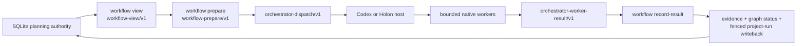

# Native Workflow Lifecycle

## Purpose

Define the host-neutral planning-to-execution boundary for Codex, Holon, and
other hosts. `elegy-planning` owns durable planning state and lifecycle
contracts. The host owns native child-agent/session execution, approval,
cancellation, sandboxing, and provider selection.



The view, dispatch, and worker result are derived or transport artifacts. They
are never a second authority for goals, roadmaps, work points, graph edges,
leases, evidence, or review state.

## CLI Contract

Inspect the derived plan without mutating it:

```bash
elegy-planning --scope <scope> --json --non-interactive \
  workflow view --entity-type roadmap --entity-id <roadmap-id>
```

Prepare one bounded batch. This claims and activates eligible project runs in
one SQLite transaction:

```bash
elegy-planning --scope <scope> --json --non-interactive \
  --correlation-id <dispatch-correlation> workflow prepare \
  --entity-type roadmap --entity-id <roadmap-id> --max-workers 3
```

The result contains `workflow-prepare/v1` and one or more
`orchestrator-dispatch/v1` records. Each dispatch includes:

- planning source, graph node, and source revision
- project-run ID, lease, fencing token, and idempotency key
- adapter ID and required capabilities such as `browser`, `container`, or `e2e`
- role, worker profile, complexity, and low/medium/high reasoning class
- file scopes, allowed actions, required evidence kinds, and bounded budgets
- a compact handoff and explicit stop conditions

Workers write one `orchestrator-worker-result/v1` JSON object. The host submits
it as one fenced writeback:

```bash
elegy-planning --scope <scope> --json --non-interactive \
  --correlation-id <result-correlation> workflow record-result \
  --file <worker-result.json>
```

The writeback validates the dispatch identity, source revision, fence, lease,
and idempotency key. It atomically creates evidence, attaches the evidence to
the work node, updates the graph status, records project-run evidence, and
releases the project run as completed, failed, or cancelled. Replaying the same
idempotency key is a read-only success. A stale fence or changed source is
rejected without writeback.

`workflow render|export` remain projection aliases. `workflow bundle` remains
a file projection for inspection and compatibility; its worker paths are
relative to the bundle root. It does not execute workers or replace native
host orchestration.

`workflow import-artifact|export-artifact` remain compatibility bridges for
instruction-engine roadmap artifacts. SQLite remains authoritative after an
import.

## Source Binding

Graph work nodes used for dispatch must carry a binding in `payload`:

```json
{
  "planningRef": { "entityType": "roadmap", "entityId": "RM-example" },
  "workPointId": "WP-example"
}
```

The workflow view includes only nodes and edges rooted in the requested source.
Legacy unbound graph data is temporarily visible for migration compatibility
when no bindings exist in the scope; new dispatches require `workPointId`.

## Scheduling Policy

The default is one worker. Parallel dispatch is allowed only when all of the
following are true:

1. the current phase is independently runnable;
2. each pair has an active `parallel-safe-with` graph edge;
3. declared file scopes are present and pairwise disjoint;
4. the host can provide the required worker capability.

Unknown or overlapping scopes remain sequential. The portable cap is three
workers. The orchestrator remains the host main thread; worker depth is one.
Workers use low or medium reasoning by default. High reasoning is reserved for
explicitly heavy or review work. The portable dispatch never selects an
`xhigh` worker tier.

## Evidence And Failure

Worker results must be structured and bounded:

- result file maximum: 1 MiB
- worker content maximum: 1 MiB, with a 32 KiB default output budget
- summary maximum: 16 KiB
- statuses: `completed`, `failed`, `cancelled`, `timed-out`, `malformed`

Failures, cancellations, timeouts, malformed results, degraded host
capabilities, and newly discovered scope are durable evidence. They do not
silently complete a work point. The host refreshes `workflow view` after every
writeback before dispatching another phase.

## Host Boundary

| Host | Responsibility |
| --- | --- |
| Codex | Main-thread orchestration and native bounded child-agent calls |
| Holon | Session tree, approvals, provider routing, UI, and native execution |
| Other adapters | Consume the portable dispatch/result contracts and record capability gaps |

Elegy does not spawn a generic subprocess worker. A future CLI or MCP adapter
may be added only as a conforming transport adapter with the same contracts,
fencing, budgets, and result writeback semantics.

## Metrics

The current view exposes total nodes/edges, runnable and blocked counts,
delegation hints, estimated context, parallel-safe candidates, and project-run
status counts. Hosts should additionally record wall time, worker count,
retry count, result bytes, validation outcome, and whether the plan degraded to
sequential execution. Efficiency comparisons should use matched task and
budget cohorts; successful completion alone is not an efficiency measure.

## Acceptance

- source-rooted workflow views cannot leak unrelated graph nodes or runs;
- unknown and overlapping file scopes never produce parallel dispatch;
- `workflow prepare` emits bounded native dispatches and fenced project runs;
- `workflow record-result` performs atomic evidence/status/run writeback;
- stale fences, changed source revisions, wrong targets, and malformed results
  fail closed;
- repeated result submission is idempotent;
- bundle paths are portable relative paths;
- no generic workflow runner is shipped or advertised by the host crate;
- Codex and Holon remain host owners of execution and approval policy.
